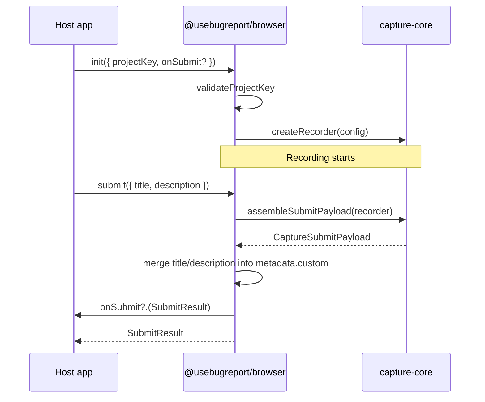

# Story 1.4: publishable `@usebugreport/browser` SDK package

Status: done

<!-- Ultimate context engine analysis completed - comprehensive developer guide created -->

## Story

As an integrator,
I want a documented npm package with init API and submit hook,
so that I can embed capture in my app with minimal bundle size (FR-1).

## Acceptance Criteria

1. **Given** `packages/sdk` build completes, **when** the package is consumed as `@usebugreport/browser`, **then** the public surface exports `init(options)` and `submit({ title, description? })` (plus `dispose()` for cleanup); **and** a named export `useBugReport` object with `{ init, submit, dispose }` matches PRD addendum init shape; **and** dependency graph includes only `@usebugreport/capture-core` (no Mantine, Radix, or `apps/*` imports).

2. **Given** valid init options `{ projectKey: 'ubr_ingest_...' }`, **when** `init()` runs in a browser environment, **then** a capture-core recorder starts with mapped config (`bufferSeconds`, `captureConsole`, `captureNetwork`, `captureScreenshot`, `screenshotMode`, `maskSelectors`, `blockClass`, `metadata` → `metadataProvider`); **and** `projectKey` is stored for future ingest auth (E2 `X-Ingest-Key` header); **and** recording begins immediately after successful init.

3. **Given** missing, empty, or whitespace-only `projectKey`, **when** `init()` is called, **then** SDK throws a clear configuration error (`UseBugReportConfigError` or equivalent) **before** `createRecorder()` runs; **and** no recorder side effects occur.

4. **Given** `projectKey` that does not start with `ubr_ingest_` or is shorter than the server-generated minimum (`ubr_ingest_` + 32 base62 chars ≈ 43 chars total per `packages/services/src/project.ts`), **when** `init()` is called, **then** SDK throws the same class of configuration error before recording starts.

5. **Given** SDK initialized and user calls `submit({ title, description? })`, **when** submit runs in a browser, **then** SDK calls `assembleSubmitPayload(recorder)` from capture-core; **and** merges `title` and `description` into payload metadata (`metadata.custom.title`, `metadata.custom.description` or dedicated top-level fields inside `custom` — pick one, document in types); **and** returns `SubmitResult` `{ projectKey, title, description?, payload: CaptureSubmitPayload }`; **and** invokes optional `onSubmit` callback from init options with the same result; **and** **no HTTP** calls to `/api/v1/capture/*` (deferred to E1-S5 widget + E2-S2 ingest).

6. **Given** `submit()` called before `init()` or after `dispose()`, **when** submit runs, **then** SDK throws `UseBugReportNotInitializedError` (or equivalent) with actionable message.

7. **Given** `package.json` for `@usebugreport/browser`, **when** inspected after this story, **then** it is publish-ready: `"name": "@usebugreport/browser"`, semver `SDK_VERSION` aligned (e.g. `0.1.0`), `"type": "module"`, `"exports"` map for `"."` → `./dist/index.js` + types, `"files": ["dist"]`, `"sideEffects": false`, `"private": false` (or removed); **and** `"description"`, `"keywords"`, `"license"` fields populated; **and** workspace dep `"@usebugreport/capture-core": "workspace:*"` retained (capture-core stays private internal — SDK is the public npm surface).

8. **Given** public API design, **when** integrator imports `@usebugreport/browser`, **then** only SDK-level types are exported (`UseBugReportInitOptions`, `SubmitOptions`, `SubmitResult`, errors); **and** low-level capture-core symbols (`createRecorder`, `gzipJson`, plugin internals) are **not** re-exported from the package root (YAGNI — integrators use `init`/`submit` only).

9. **Given** `packages/sdk` unit tests with happy-dom (reuse capture-core preload patterns), **when** `bun test packages/sdk` runs, **then** tests cover: `projectKey` validation (missing/wrong prefix/too short), init→submit happy path payload shape, submit-without-init error, `onSubmit` callback invocation, and gzip parts present in submit result (architecture §13 SDK layer); **and** `bunx turbo run lint typecheck test build --filter=@usebugreport/browser...` passes.

10. **Out of scope for this story:** HTTP ingest (`POST /api/v1/capture/presign|complete|ingest` — E2-S2+), `Idempotency-Key` header generation, shadow DOM submit widget (E1-S5), npm registry publish CI, `reportId` from server response, Mantine/Radix UI, changes to `apps/api`/`apps/worker`, capture-core feature work (E1-S2/S3 complete).

## Tasks / Subtasks

- [x] Task 1 — Public types and validation (AC: 3, 4, 8)
  - [x] Create `packages/sdk/src/types.ts`: `UseBugReportInitOptions`, `SubmitOptions`, `SubmitResult`, error classes
  - [x] Create `packages/sdk/src/validate.ts`: `validateProjectKey(key: string): asserts key is string` — prefix `ubr_ingest_`, min length 43, trim rejection
  - [x] Map PRD addendum `metadata: () => ({...})` → capture-core `metadataProvider`

- [x] Task 2 — Module state + init (AC: 2, 3, 4, 6)
  - [x] Create `packages/sdk/src/state.ts`: singleton holding `Recorder | null`, `projectKey`, `onSubmit` callback, init guard
  - [x] Create `packages/sdk/src/init.ts`: validate → map options → `createRecorder(config)` → store state; throw on double-init unless prior `dispose()`
  - [x] Browser guard: throw outside `window` (match capture-core pattern)

- [x] Task 3 — Submit API (AC: 5, 6)
  - [x] Create `packages/sdk/src/submit.ts`: assert initialized → `assembleSubmitPayload(recorder)` → merge title/description into metadata → build `SubmitResult` → await `onSubmit?.(result)` → return result
  - [x] Create `packages/sdk/src/dispose.ts`: stop recorder, clear singleton state

- [x] Task 4 — Public entry + package metadata (AC: 1, 7, 8)
  - [x] Rewrite `packages/sdk/src/index.ts`: export `init`, `submit`, `dispose`, `useBugReport`, `SDK_VERSION`, public types/errors only — remove capture-core re-exports
  - [x] Bump `SDK_VERSION` to `0.1.0`; align `package.json` `"version"`
  - [x] Add publish-ready fields: `files`, `sideEffects`, `description`, `keywords`, `license`; set `"private": false`
  - [x] Optional: minimal `packages/sdk/README.md` with init/submit example (integrator-facing, no HTTP yet)

- [x] Task 5 — SDK unit tests (AC: 9)
  - [x] Add `packages/sdk/src/test/preload.ts` (mirror capture-core happy-dom + CompressionStream polyfill if needed)
  - [x] Expand `packages/sdk/src/index.test.ts` + focused tests for validate, init, submit, dispose
  - [x] Wire `bun test --preload ./src/test/preload.ts` in sdk `package.json` scripts if preload added

- [x] Task 6 — Verification gate (AC: 9)
  - [x] Run verification commands in Testing Requirements
  - [x] Confirm capture-core tests still pass unchanged (no regressions)

## Dev Notes

### Goal

Queue position **#11** in sprint plan — delivers the **public integrator API** (`init`/`submit`) wrapping E1-S2 recorder + E1-S3 `assembleSubmitPayload`. Makes `@usebugreport/browser` publish-ready at the package-metadata level. **No network I/O** — E1-S5 adds widget UI; E2-S2 adds presign/inline upload using stored `projectKey`.

### Scope boundary (critical)

| In E1-S4 | Deferred |
| --- | --- |
| `init({ projectKey, bufferSeconds?, onSubmit?, ... })` | Shadow DOM widget (E1-S5) |
| `submit({ title, description? })` → `CaptureSubmitPayload` + callback | HTTP to `/api/v1/capture/*` (E2-S2+) |
| `projectKey` validation (`ubr_ingest_*`) | `Idempotency-Key` header (E1-S5/E2) |
| Publish-ready `package.json` exports/metadata | Actual npm registry publish / CI |
| SDK unit tests (validation, init/submit flow, gzip in payload) | Server `reportId` in submit result |
| `dispose()` cleanup | Bundled CDN build (optional follow-up) |
| Narrow public exports (no capture-core leak) | Changes to capture-core behavior |

**Do not touch:** `apps/api`, `apps/worker`, `apps/web`, `packages/services`, `packages/db`, `packages/storage`, capture-core internals (unless type import only), `_bmad-output/` (except this story + sprint-status).

### Current repo state (main @ d263877 — modify these)

| Path | Current state | This story changes |
| --- | --- | --- |
| `packages/sdk/src/index.ts` | Re-exports entire capture-core surface; `SDK_VERSION = "0.0.0-stub"` | Public `init`/`submit`/`dispose` only; version `0.1.0` |
| `packages/sdk/src/index.test.ts` | Single re-export smoke test | Full SDK API test suite |
| `packages/sdk/package.json` | `"private": true`, `"version": "0.0.0"`, minimal metadata | Publish-ready fields; `"private": false` |
| `packages/sdk/tsconfig.json` | tsc → `dist/` | unchanged (tsc ESM sufficient for v1) |
| `packages/capture-core/src/index.ts` | Exports `createRecorder`, `assembleSubmitPayload`, etc. | **read-only** — SDK imports these internally |
| `packages/capture-core/src/submit-payload.ts` | `assembleSubmitPayload(recorder, options?)` | **read-only** — SDK calls at submit time |
| `packages/capture-core/src/record.ts` | `createRecorder(config)` | **read-only** — SDK calls at init |
| `packages/services/src/project.ts` | `ubr_ingest_${randomBase62(32)}` key format | **read-only** — validation must match |

E1-S3 delivered (commit `d263877`): `assembleSubmitPayload`, screenshot, metadata, gzip parts, 38 capture-core tests. SDK currently re-exports capture-core — **replace** with thin wrapper.

### Recommended public API contract

```typescript
// packages/sdk/src/types.ts (implement)
export class UseBugReportConfigError extends Error {
  readonly code = "UBR_CONFIG_ERROR";
}
export class UseBugReportNotInitializedError extends Error {
  readonly code = "UBR_NOT_INITIALIZED";
}

export interface UseBugReportInitOptions {
  projectKey: string;
  bufferSeconds?: number;
  captureConsole?: boolean;
  captureNetwork?: boolean;
  captureScreenshot?: boolean;
  screenshotMode?: "viewport" | "fullPage";
  networkBodyMaxBytes?: number;
  maskSelectors?: string[];
  blockClass?: string;
  /** PRD addendum: metadata hook → capture-core metadataProvider */
  metadata?: () => Record<string, unknown>;
  /** Called after submit assembles payload (before any HTTP in E2) */
  onSubmit?: (result: SubmitResult) => void | Promise<void>;
}

export interface SubmitOptions {
  title: string;
  description?: string;
}

export interface SubmitResult {
  projectKey: string;
  title: string;
  description?: string;
  payload: CaptureSubmitPayload; // import type from capture-core — not re-exported at root unless needed
}
```

```typescript
// packages/sdk/src/index.ts (target exports)
export function init(options: UseBugReportInitOptions): void;
export function submit(options: SubmitOptions): Promise<SubmitResult>;
export function dispose(): void;
export const useBugReport: { init: typeof init; submit: typeof submit; dispose: typeof dispose };
export const SDK_VERSION: string;
export type { UseBugReportInitOptions, SubmitOptions, SubmitResult };
export { UseBugReportConfigError, UseBugReportNotInitializedError };
```

### Init → capture-core config mapping

| `UseBugReportInitOptions` | `CaptureCoreConfig` field |
| --- | --- |
| `bufferSeconds` | `bufferSeconds` |
| `captureConsole` | `captureConsole` |
| `captureNetwork` | `captureNetwork` |
| `captureScreenshot` | `captureScreenshot` |
| `screenshotMode` | `screenshotMode` |
| `networkBodyMaxBytes` | `networkBodyMaxBytes` |
| `maskSelectors` | `maskSelectors` |
| `blockClass` | `blockClass` |
| `metadata` | `metadataProvider` |

Do **not** pass `projectKey` into capture-core — it is SDK-only state for E2 auth headers.

Default `ignoreRequestFn` for ingest feedback-loop prevention is already in capture-core network plugin (E1-S2) — no SDK override needed unless integrator passes custom fn (defer custom `ignoreRequestFn` to v1.1 unless trivial passthrough added).

### Submit flow (no HTTP)



E1-S5 widget will call the same `submit()` then add HTTP upload. E2-S2 implements upload using `projectKey` as `X-Ingest-Key`.

### projectKey validation rules

| Rule | Error message hint |
| --- | --- |
| `typeof projectKey !== 'string'` or empty/whitespace after trim | `"projectKey is required"` |
| !startsWith(`ubr_ingest_`) | `"projectKey must be a project ingest key (ubr_ingest_...)"` |
| length < 43 | `"projectKey appears truncated"` |

Reference: `packages/services/src/project.ts` `generateIngestKey()` → `ubr_ingest_${randomBase62(32)}`.

Server auth reference (E2, read-only): `apps/api/src/middleware/api-key-auth.ts` `INGEST_KEY_PREFIX = "ubr_ingest_"`.

### Architecture anchors (must follow)

| Anchor | Requirement |
| --- | --- |
| FR-1 | Integrators embed SDK with Project Ingest Key; 30–120s buffer |
| FR-2 | Privacy defaults flow through init config → capture-core |
| FR-3 | Submit attaches screenshot + metadata via `assembleSubmitPayload` |
| §2 Dependency direction | `packages/sdk` → `packages/capture-core` only; no `apps/*` |
| §2 Package layout | `@usebugreport/browser` published from `packages/sdk`; capture-core private |
| §13 Testing | SDK layer: buffer, redaction, gzip covered in sdk tests |
| AD-4 | Client-side blob path — payload assembled here; upload in E2 |
| ARCHITECTURE-SPINE auth | Ingest: `X-Ingest-Key: ubr_ingest_*` — store key now, send in E2 |
| PRD addendum SDK Init Shape | `useBugReport.init({ projectKey, bufferSeconds, metadata })` |

### Publish-ready package.json checklist

```json
{
  "name": "@usebugreport/browser",
  "version": "0.1.0",
  "description": "Browser SDK for usebugreport session capture and bug report submit",
  "type": "module",
  "sideEffects": false,
  "files": ["dist"],
  "exports": {
    ".": {
      "types": "./dist/index.d.ts",
      "default": "./dist/index.js"
    }
  },
  "keywords": ["bug-report", "session-replay", "rrweb", "usebugreport"],
  "license": "UNLICENSED",
  "dependencies": {
    "@usebugreport/capture-core": "workspace:*"
  }
}
```

**Bundling note:** v1 uses tsc ESM output with capture-core as runtime dependency (monorepo `workspace:*`). Full single-file browser bundle (esbuild) is **not required** this story — npm consumers install both packages when capture-core is published internally later. Do not add esbuild unless King approves new dep; tsc path is sufficient for LG-1 monorepo embed.

### Testing Requirements

Run from repo root after implementation:

```bash
bun install
bun test packages/sdk
bun test packages/capture-core   # regression — must still pass (38 tests)
bunx turbo run lint typecheck test build --filter=@usebugreport/browser...
bunx biome check packages/sdk
```

**Minimum SDK test cases:**

1. `validateProjectKey` rejects missing, wrong prefix, too-short keys
2. `init` with valid key creates recorder (spy/mock `createRecorder` or happy-dom smoke)
3. `init` with invalid key throws before recorder creation
4. `submit` without init throws `UseBugReportNotInitializedError`
5. `submit` after init returns `SubmitResult` with `payload.parts.replay`, `.console`, `.network`, `.meta`, gzip magic bytes when CompressionStream available
6. `onSubmit` callback receives same result as return value
7. `dispose` clears state; subsequent `submit` throws
8. Title/description appear in `payload.parts.meta.json.custom` (or chosen merge location)

**happy-dom setup:** Copy/adapt `packages/capture-core/src/test/preload.ts` for sdk tests — register happy-dom globals, polyfill CompressionStream if missing.

### Anti-patterns (do not do)

- Do not implement fetch/XHR to presign/complete/ingest — E2-S2 / E1-S5
- Do not build shadow DOM widget — E1-S5
- Do not re-export full capture-core API from sdk root — integrators use init/submit
- Do not duplicate `assembleSubmitPayload` or recorder logic in sdk — delegate to capture-core
- Do not add Mantine, Radix, or app-layer dependencies to sdk
- Do not modify capture-core behavior unless sdk integration reveals a blocking bug (fix in separate commit with scope note)
- Do not assign R2 keys or generate `reportId` client-side — server assigns in E2
- Do not break existing capture-core 38 tests

### Epic E1 cross-story context

| Story | Relationship |
| --- | --- |
| E1-S1 (done) | Monorepo scaffold, sdk package stub |
| E1-S2 (done) | `createRecorder`, privacy plugins, buffer |
| E1-S3 (done) | `assembleSubmitPayload`, screenshot, metadata, gzip |
| **E1-S4 (this)** | Public `init`/`submit` wrapper + publishable package.json |
| E1-S5 | Widget UI + HTTP upload (needs E2-S2 presign stub) |

Parallel safe after E1-S3 per sprint plan — **no E2/E4 dependency** for API wiring (validation only references key format from E4-S3).

### Git intelligence (main @ d263877)

Recent capture commits establish patterns to follow:

| Commit | Relevance |
| --- | --- |
| `d263877` feat: assemble submit payload with screenshot and metadata | `assembleSubmitPayload` API to call from `submit()` |
| `5a9a69c` feat: capture instant replay with privacy-first plugins | `createRecorder` + happy-dom test preload pattern |

SDK code style: strict TS, Biome lint, co-located `*.test.ts`, browser guards on public entrypoints.

### Previous story intelligence (E1-S3)

- `assembleSubmitPayload(recorder, options?)` returns `CaptureSubmitPayload` with `parts.replay|console|network|meta|screenshot`
- `recorder.getResolvedConfig()` available for config introspection
- `registerMetadataProvider` exists in capture-core — prefer init `metadata` callback mapped to `metadataProvider` in recorder config (avoid global provider race in multi-instance future)
- CompressionStream polyfilled in capture-core test preload — reuse in sdk tests
- SDK re-exports were intentional stub — **replace entirely** with init/submit wrapper
- Review deferrals (fullPage test, UA parser) do not block E1-S4

### Library / version requirements

| Item | Version | Notes |
| --- | --- | --- |
| `@usebugreport/capture-core` | workspace `0.2.0` | Internal dep; CAPTURE_CORE_VERSION |
| TypeScript | ^5.8 | tsc build unchanged |
| happy-dom | ^20.x (devDep in sdk if needed) | Browser test env |
| New runtime deps | **none** | Wrapper only |

### Project Structure Notes

New files (expected):

```text
packages/sdk/
  src/
    index.ts          # public exports
    types.ts
    validate.ts
    state.ts
    init.ts
    submit.ts
    dispose.ts
    index.test.ts
    validate.test.ts  # optional split
    test/preload.ts   # if needed
  package.json        # publish metadata
  README.md           # optional minimal integrator doc
```

Keep modules small and local (YAGNI) — no `src/widget/` until E1-S5.

### References

- [Source: _bmad-output/planning-artifacts/epics-usebugreport-2026-07-20/E01-capture-sdk.md#Story E1-S4]
- [Source: _bmad-output/planning-artifacts/prds/prd-usebugreport-2026-07-20/prd.md#FR-1]
- [Source: _bmad-output/planning-artifacts/prds/prd-usebugreport-2026-07-20/addendum.md#SDK Init Shape]
- [Source: _bmad-output/planning-artifacts/architecture-usebugreport-2026-07-20/architecture.md#§2 Monorepo, §13 Testing]
- [Source: _bmad-output/planning-artifacts/architecture-usebugreport-2026-07-20/ARCHITECTURE-SPINE.md#Auth headers]
- [Source: _bmad-output/implementation-artifacts/1-3-screenshot-and-environment-metadata-at-submit.md]
- [Source: _bmad-output/implementation-artifacts/sprint-plan-2026-07-20.md#Launch Queue position 11]
- [Source: packages/capture-core/src/submit-payload.ts — assembleSubmitPayload]
- [Source: packages/capture-core/src/record.ts — createRecorder]
- [Source: packages/services/src/project.ts — ingest key format]
- [Source: apps/api/src/middleware/api-key-auth.ts — INGEST_KEY_PREFIX]

## Dev Agent Record

### Agent Model Used

Composer (subagent)

### Debug Log References

- Completed WIP under `packages/sdk`; added tests, publish metadata, README
- Added `DOM` lib + test preload exclude to `tsconfig.json` for browser API typecheck

### Completion Notes List

- Public `@usebugreport/browser` API: `init`, `submit`, `dispose`, `useBugReport`, `SDK_VERSION` v0.1.0
- `projectKey` validation before recorder creation; title/description merged into `metadata.custom`
- No HTTP or capture-core re-exports; publish-ready `package.json`
- 13 SDK tests + 38 capture-core regression tests passing

### File List

- packages/sdk/package.json
- packages/sdk/tsconfig.json
- packages/sdk/README.md
- packages/sdk/src/index.ts
- packages/sdk/src/types.ts
- packages/sdk/src/validate.ts
- packages/sdk/src/state.ts
- packages/sdk/src/init.ts
- packages/sdk/src/submit.ts
- packages/sdk/src/dispose.ts
- packages/sdk/src/index.test.ts
- packages/sdk/src/validate.test.ts
- packages/sdk/src/test/preload.ts

### Review Findings

**Verdict: approved (done)** — 2026-07-20 code review (headless)

- [x] [Review][Defer] `SubmitResult.payload` types reference private `@usebugreport/capture-core` — deferred; story scope retains workspace dep until capture-core npm publish [`packages/sdk/src/types.ts`]
- [x] [Review][Defer] No `createRecorder` spy asserting zero side effects on invalid `projectKey` — deferred; init validates before `createRecorder()` call order is correct [`packages/sdk/src/init.ts`]
- [x] [Review][Defer] Browser guard throws generic `Error` instead of SDK error class — deferred; matches capture-core pattern [`packages/sdk/src/init.ts`, `packages/sdk/src/submit.ts`]

**Verification:** `bun test packages/sdk` 13 pass; `bunx turbo run lint typecheck test build --filter=@usebugreport/browser...` 8/8 green; capture-core 38 pass.

## Change Log

- 2026-07-20: E1-S4 story context created (ready-for-dev)
- 2026-07-20: Implemented publishable browser SDK wrapper; status → review
- 2026-07-20: Code review approved (headless); status → done
