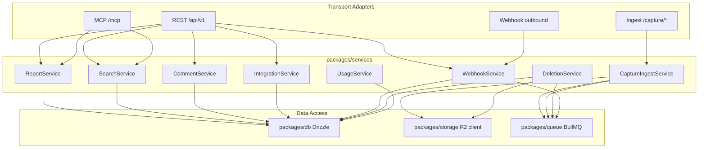

# Architecture Spine — usebugreport

## Design Paradigm

**Layered monolith with shared domain services.** One Bun process model split into three deployable containers (`api`, `worker`, `web`) sharing packages. Business logic lives exclusively in `packages/services`; REST (`apps/api/src/routes`), MCP (`apps/api/src/mcp`), and BullMQ workers (`apps/worker`) are thin adapters. Postgres is system of record; R2 is blob store; Redis is queue + rate-limit state.



## System Invariants

Explicit invariants enforced across services, workers, and CI:

| Invariant | Enforcement |
| --- | --- |
| **BullMQ payloads contain references only** — never replay blobs, screenshots, or gzip batches | `packages/queue` payload types are `z.object({ reportId, r2Key, ... })` only; CI grep rejects `Buffer`/`Uint8Array` in job payloads |
| **Deletion tombstones survive tenant deletion** — control record lives outside org FK cascade | `deletion_tombstones` table has no FK to `organizations`; Postgres purge step runs last |
| **Every tenant-scoped query includes `organization_id`** | Service methods require `AuthContext.organizationId`; Drizzle queries linted in CI |
| **Raw blob keys and presigned URLs never logged** | Pino redaction paths on `r2Key`, `url`, `presignedUrl`; log review in PR template |

Full FR traceability: [`architecture.md` §18](./architecture.md#18-requirements-traceability-matrix-fr-1fr-26).

## Invariants & Rules

### AD-1 — Shared service layer is sole business-logic owner

- **Binds:** FR-17, FR-18, LG-6, E5, E6
- **Prevents:** MCP and REST diverging on filters, pagination, or field shapes
- **Rule:** All report/search/comment/ingest/integration logic lives in `packages/services`. Route and MCP handlers call service methods only. CI fails if `apps/api/src/mcp` or `apps/api/src/routes` contain Drizzle queries or R2 calls.

### AD-2 — REST/MCP parity via surface registry + contract tests

- **Binds:** FR-15, FR-17, FR-18, LG-5, LG-6
- **Prevents:** Tool added to MCP without REST equivalent (or vice versa)
- **Rule:** `packages/contracts/src/surface-registry.ts` declares each operation once: `{ id, service, method, restPath, restMethod, mcpTool, scopes }`. REST routes and MCP tools validated from registry at build time. `packages/contracts/tests/parity.test.ts` exercises each operation via **real HTTP** — REST `fetch()` to `/api/v1/*` and MCP Streamable HTTP to `POST /mcp` — asserting field-equivalent outputs, auth scopes, error envelopes, and Free-tier write rejection.

### AD-3 — Tenancy scoping on every mutation and query

- **Binds:** FR-8, FR-9, FR-14, FR-22
- **Prevents:** Cross-workspace data leaks via API key or session
- **Rule:** Every service method accepts `AuthContext { type, organizationId, userId?, apiKeyId?, projectIds? }` as first argument. Middleware in `apps/api/src/middleware/auth.ts` resolves context; services reject when `organizationId` cannot be derived. Project-scoped reads check `project_members` unless caller is org owner/admin.

### AD-4 — Ingest durability: R2-first, BullMQ references only

- **Binds:** FR-1, FR-3, FR-4, LG-1, LG-8, E2
- **Prevents:** VPS disk exhaustion, queue bloat, and lost blobs on worker crash
- **Rule:** **BullMQ payloads contain references only** — `{ reportId, r2Keys[], idempotencyKey, projectId }`, never blob bytes.
  - **Large path:** SDK calls `POST /api/v1/capture/presign` (after ingest-key auth + rate-limit check) → presigned PUT URLs → client uploads to R2 → `POST /api/v1/capture/complete` → enqueues `ingest.finalize` → worker validates objects, writes Postgres metadata.
  - **Inline path (≤1 MB):** API streams body to R2 **before** HTTP ack → enqueues `ingest.finalize` with refs only → returns `202` within 200ms p95. E2 implementation must measure ack latency; if the R2 round-trip breaks the inherited <200ms p95 ack target, relax p95 for the inline path only — durability (stream-to-R2-before-ack) is never weakened.

### AD-5 — Idempotent ingest and webhook side effects

- **Binds:** FR-4, FR-19, FR-21
- **Prevents:** Duplicate reports and duplicate Linear issues on retry
- **Rule:** SDK sends `Idempotency-Key`. `CaptureIngestService` upserts on `(project_id, idempotency_key)`. Linear push uses `integration_operations` outbox with `UNIQUE (report_id, action)` — concurrent pushes return existing URL.

### AD-6 — Blob access via short-lived R2 presigned URLs

- **Binds:** FR-6, FR-7
- **Prevents:** API server streaming multi-MB replays through VPS bandwidth
- **Rule:** `ReportService.getReplayManifest(reportId)` returns presigned GET URLs (TTL 15 min) for `report_blobs.r2_key` rows. Web app fetches replay blobs client-side via those URLs. Presigned replay URLs are **never** exposed via MCP tool results; no replay-manifest operation exists in the surface registry, and none may be added without a new architecture decision. No proxy-through-api for replay bytes.

### AD-7 — Postgres FTS for v1 search

- **Binds:** FR-5, FR-15, LG-5
- **Prevents:** Premature vector/semantic search infrastructure
- **Rule:** `reports.search_vector` is a generated `tsvector` from `title`, `description`, `summary_text`. `SearchService.searchReports` uses `websearch_to_tsquery('english', q)` with GIN index. No Elasticsearch/OpenSearch in v1.

### AD-8 — GDPR deletion: tombstone outside tenant cascade

- **Binds:** FR-10, LG-7, E9
- **Prevents:** Self-invalidating cascade and orphan R2 objects
- **Rule:** `DeletionService.enqueueWorkspaceDeletion(orgId)` creates `deletion_tombstones` row (**no FK to `organizations`**). Ordered idempotent steps: notify owner (email snapshot) → external purge (R2 + Redis) → audit terminal state on tombstone → **last:** Postgres tenant purge. Resume from `last_completed_step`. p95 SLA 72h.

### AD-9 — Usage and rate limits enforced at ingest boundary

- **Binds:** FR-4, LG-8
- **Prevents:** Free tier overage and Pro fair-use collapse
- **Rule:** `workspace_usage_monthly` incremented on `ingest.finalize` completion. Free hard cap 30 → HTTP 429 before enqueue. Pro soft cap 2000 → HTTP 429 with `Retry-After`. Per-ingest-key Redis sliding window: 10/min, burst 20. Max 100 concurrent `ingest.finalize` jobs per workspace.

### AD-10 — Keyboard shortcut single registry

- **Binds:** FR-11, FR-12, FR-13, LG-9, E3
- **Prevents:** Palette and `useHotkeys` drift
- **Rule:** `apps/web/src/keyboard/shortcuts.ts` exports `SHORTCUTS` map consumed by `@mantine/spotlight` actions and `useHotkeys` hooks. No ad-hoc key listeners outside this module.

### AD-11 — Tier limits enforced at service boundary

- **Binds:** FR-4, FR-7, FR-8, FR-14, FR-19, FR-22, LG-8, E4
- **Prevents:** UI-only tier gating that API/MCP bypass
- **Rule:** `UsageService.checkTierLimit()` at service entry per PRD §9 (Free/Pro sellable v1; Studio/Agency defined-not-sellable): workspaces (Free 1 / Pro 5), reports/mo (30 / 2k fair-use), integrations (Free 1), webhooks Pro+, MCP read-only on Free.

## Consistency Conventions

| Concern | Convention |
| --- | --- |
| IDs | `org_*`, `prj_*`, `rpt_*`, `cmt_*`, `whk_*`; UUIDv7 internally, prefixed external IDs |
| Timestamps | ISO 8601 UTC in API; `timestamptz` in Postgres |
| Error envelope | `{ error: { code, message, details?, requestId } }` — codes: `UNAUTHORIZED`, `FORBIDDEN`, `NOT_FOUND`, `RATE_LIMITED`, `QUOTA_EXCEEDED`, `VALIDATION_ERROR`, `INTERNAL` |
| Pagination | Cursor-based: `?cursor=&limit=50` (max 100); response `{ data, page: { nextCursor, hasMore } }` |
| Auth headers | Session cookie (web); `Authorization: Bearer ubr_live_*` (API/MCP); ingest: `X-Ingest-Key: ubr_ingest_*` or body `projectKey` |
| Logging | JSON structured: `{ level, msg, traceId, organizationId, reportId, userId }`; **never** log `r2Key` or presigned URLs |
| Secrets | Env vars only; OAuth tokens encrypted with `ENCRYPTION_KEY` in `integrations.oauth_tokens_encrypted` |

## Stack

| Name | Version |
| --- | --- |
| Bun | 1.2.x |
| turborepo | 2.x |
| Next.js (App Router) | 15.x |
| Mantine | 7.x |
| TanStack Query / Table | 5.x |
| ElysiaJS | 1.x |
| @elysiajs/swagger | 1.x |
| better-auth | 1.x (organization, apiKey, bearer plugins) |
| PostgreSQL | 16.x |
| Drizzle ORM | 0.38+ |
| Redis | 7.x |
| BullMQ | 5.x |
| @aws-sdk/client-s3 (R2) | 3.x |
| @modelcontextprotocol/sdk | 1.x (pinned until v2 GA) |
| rrweb + official plugins | 2.x |
| bun test | built-in |
| Playwright | 1.x |

## Structural Seed

```text
usebugreport/
  apps/
    web/                 # Next.js App Router, Mantine, TanStack Query
    api/                 # Elysia: REST, MCP, auth, ingest endpoints
    worker/              # BullMQ consumers (ingest, webhooks, deletion, retention)
  packages/
    db/                  # Drizzle schema, migrations, client
    contracts/           # Zod schemas, surface-registry, OpenAPI types
    config/              # Shared env validation, constants
    services/            # Domain services (ReportService, etc.)
    storage/             # R2 S3 client helpers
    queue/               # BullMQ queue definitions, job payloads
    capture-core/        # rrweb record, plugins, buffer, privacy
    sdk/                 # @usebugreport/browser publishable package
  docker/
    docker-compose.prod.yml
  turbo.json
```

## Capability → Architecture Map

| Capability / Epic | Lives in | Governed by |
| --- | --- | --- |
| E1 Capture SDK | `packages/capture-core`, `packages/sdk` | AD-4, AD-5 |
| E2 Ingest & storage | `CaptureIngestService`, `apps/worker/ingest` | AD-4, AD-6, AD-9 |
| E3 Web app | `apps/web`, session comment route | AD-10, AD-11 |
| E4 Auth & RBAC | `apps/api/middleware`, better-auth, onboarding gate | AD-3, AD-11 |
| E5 MCP | `apps/api/src/mcp` | AD-1, AD-2 |
| E6 REST | `apps/api/src/routes` | AD-1, AD-2 |
| E7 Linear | `IntegrationService`, `integration_operations` | AD-5 |
| E8 Webhooks | `WebhookService`, `apps/worker/webhooks` | AD-5, AD-11 |
| E9 GDPR | `DeletionService`, `deletion_tombstones` | AD-8 |
| E10 create_comment (FF-1) | `CommentService` | AD-1, AD-2 |
| E11 v1.1 integrations | deferred | Deferred |

## Deferred

| Item | Revisit when |
| --- | --- |
| Semantic/vector search | Postgres FTS insufficient at scale |
| Chrome extension (`capture-extension`) | v2.0 epic |
| Multi-region / edge API | Post-100 paying workspaces or EU residency mandate |
| Real-time report list updates | v1.5 optional Redis pub/sub |
| `@elysiajs/bullmq` in-process workers | Worker container proven insufficient |
| Studio tier bi-directional sync | Studio GA pricing |
