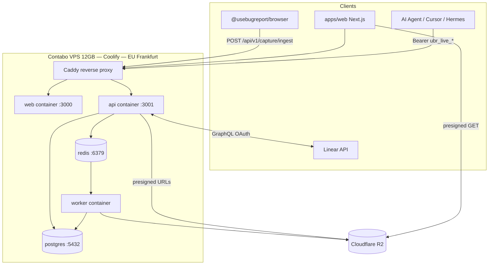
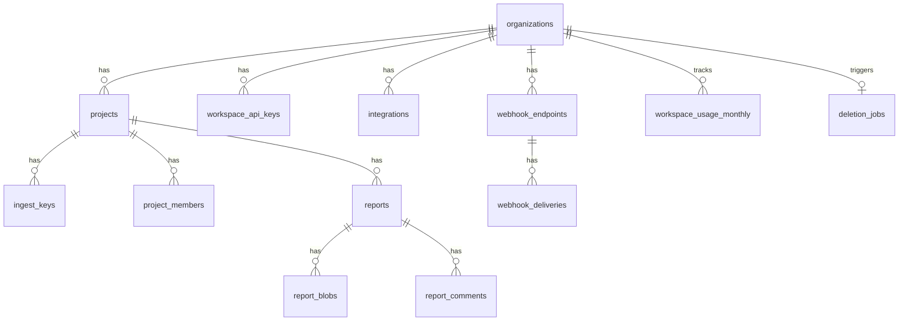
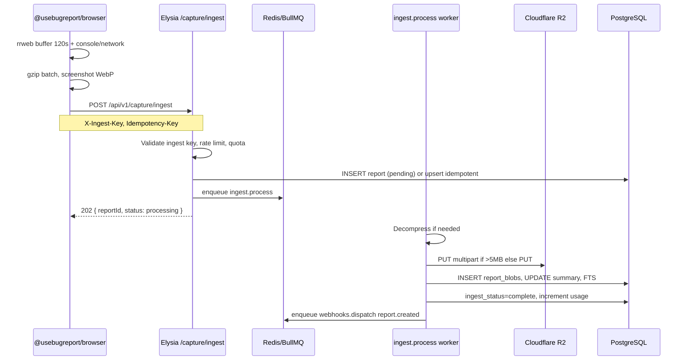
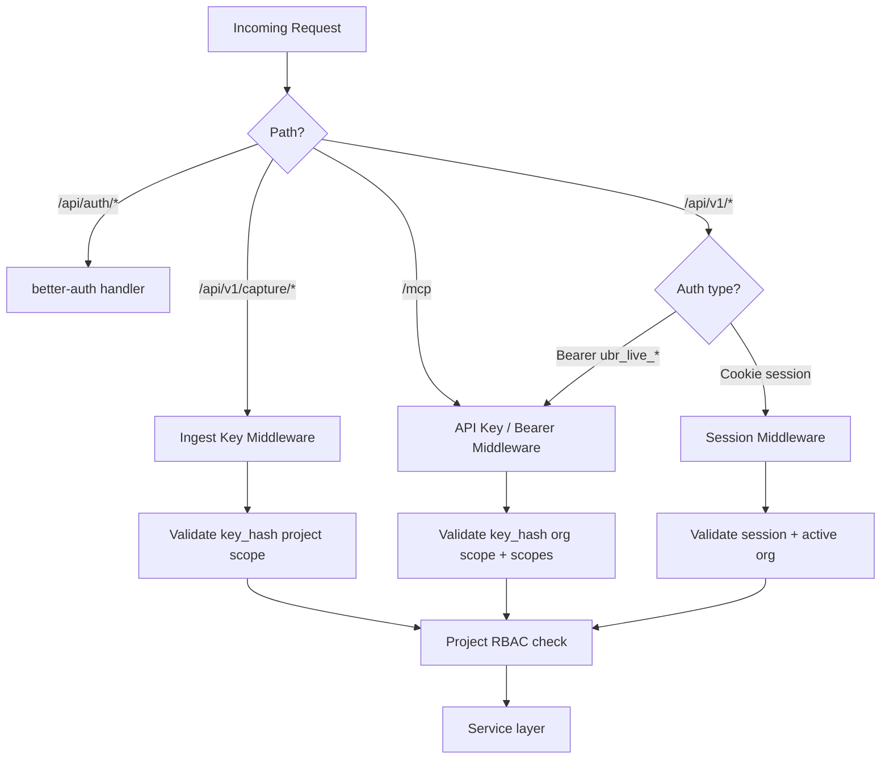

# usebugreport Platform Architecture

Architecture contract for v1.0 launch (LG-1..LG-11, epics E1–E9 launch + E10/E11 fast-follow). Companion spine: [`ARCHITECTURE-SPINE.md`](./ARCHITECTURE-SPINE.md).

---

## 1. System Overview

usebugreport is a bug-reporting and session-capture SaaS: embeddable SDK → async ingest → Postgres metadata + R2 blobs → keyboard-first web triage + MCP/REST agent access.



### Deployment topology (single VPS)

| Container | Image | Port | Role |
| --- | --- | --- | --- |
| `caddy` | caddy:2 | 443, 80 | TLS, route `app.*` → web, `api.*` → api |
| `web` | `usebugreport/web` | 3000 | Next.js SSR + static |
| `api` | `usebugreport/api` | 3001 | Elysia REST + MCP + auth + ingest |
| `worker` | `usebugreport/worker` | — | BullMQ consumers |
| `postgres` | postgres:16 | 5432 | Primary datastore |
| `redis` | redis:7-alpine | 6379 | Queues + rate limits |

Health checks: `GET /health` on api (DB + Redis ping); `GET /api/health` on web. Coolify restart policy `unless-stopped`.

**Backup strategy:** Postgres `pg_dump` daily to R2 bucket `ubr-backups/` (7-day retention). R2 object versioning optional on replay bucket. Redis AOF enabled; queue loss acceptable on disaster (jobs re-enqueued from Postgres pending states where applicable).

**Region decision:** Single EU region (Contabo Frankfurt) for v1 — satisfies EU-friendly narrative; full customer region choice deferred.

---

## 2. Monorepo Layout & Turborepo Task Graph

```text
usebugreport/
├── apps/
│   ├── web/                    # Next.js 15 App Router
│   │   ├── src/app/            # Routes per EXPERIENCE.md
│   │   ├── src/components/
│   │   ├── src/keyboard/       # SHORTCUTS registry
│   │   ├── src/lib/api-client/ # TanStack Query hooks → REST
│   │   └── src/theme/
│   ├── api/                    # Elysia application
│   │   ├── src/index.ts
│   │   ├── src/routes/         # REST handlers (thin)
│   │   ├── src/mcp/            # MCP tool handlers (thin)
│   │   ├── src/middleware/     # auth, rate-limit, trace
│   │   └── src/openapi/        # swagger plugin config
│   └── worker/
│       ├── src/index.ts
│       └── src/jobs/           # ingest, webhooks, deletion, retention
├── packages/
│   ├── db/                     # Drizzle schema + migrations
│   ├── contracts/              # Zod, surface-registry, parity tests
│   ├── config/                 # env schema (zod), tier constants
│   ├── services/               # Domain services
│   ├── storage/                # R2 client (S3-compatible)
│   ├── queue/                  # BullMQ queue names + payload types
│   ├── capture-core/           # rrweb internals (private)
│   └── sdk/                    # @usebugreport/browser (published)
├── docker/
│   ├── Dockerfile.api
│   ├── Dockerfile.worker
│   ├── Dockerfile.web
│   └── docker-compose.prod.yml
├── turbo.json
└── package.json
```

### Turborepo tasks

```json
{
  "tasks": {
    "build": { "dependsOn": ["^build"], "outputs": ["dist/**", ".next/**"] },
    "dev": { "cache": false, "persistent": true },
    "test": { "dependsOn": ["^build"] },
    "test:parity": { "dependsOn": ["build"], "inputs": ["packages/contracts/**"] },
    "lint": {},
    "typecheck": { "dependsOn": ["^build"] },
    "db:generate": { "cache": false },
    "db:migrate": { "cache": false }
  }
}
```

**Dependency direction:** `apps/*` → `packages/services` → `packages/db|storage|queue|contracts|config`. `packages/sdk` → `packages/capture-core`. No package imports from `apps/`.

---

## 3. Data Model (Drizzle Schema)

Schema lives in `packages/db/src/schema/`. All tenant tables include `organization_id` where applicable.

### 3.1 Core entities

#### `organizations` (Workspace)

| Column | Type | Notes |
| --- | --- | --- |
| `id` | text PK | `org_*` — maps to better-auth organization |
| `name` | text | |
| `slug` | text unique | URL segment `/w/[slug]` |
| `billing_tier` | enum | `free`, `pro`, `studio`, `agency` |
| `retention_days_replay` | int | Derived from tier; overridable down within tier max |
| `retention_days_screenshot` | int | |
| `created_at` | timestamptz | |

#### `projects`

| Column | Type | Notes |
| --- | --- | --- |
| `id` | text PK | `prj_*` |
| `organization_id` | text FK | |
| `name` | text | |
| `slug` | text | Unique per org |
| `default_linear_team_id` | text nullable | |
| `created_at` | timestamptz | |

#### `project_members` (project RBAC)

| Column | Type | Notes |
| --- | --- | --- |
| `project_id` | text FK | |
| `user_id` | text FK | better-auth user |
| `role` | enum | `viewer`, `reporter`, `developer`, `admin` |
| PK | (project_id, user_id) | |

Org-level roles (`owner`, `admin`, `member`) come from better-auth `member` table. Org owner/admin bypass project membership for read; mutations still respect product rules.

#### `ingest_keys`

| Column | Type | Notes |
| --- | --- | --- |
| `id` | text PK | |
| `project_id` | text FK | |
| `key_hash` | text | bcrypt/argon2 of full `ubr_ingest_*` |
| `key_prefix` | text | Last 8 chars for display |
| `revoked_at` | timestamptz nullable | Immediate effect |
| `created_at` | timestamptz | |

One active key per project at v1; rotation creates new row, revokes old.

#### `workspace_api_keys`

| Column | Type | Notes |
| --- | --- | --- |
| `id` | text PK | |
| `organization_id` | text FK | |
| `name` | text | Shown on agent comments |
| `key_hash` | text | |
| `key_prefix` | text | `ubr_live_…` |
| `scopes` | text[] | `reports:read`, `reports:write`, `mcp:tools`, `webhooks:manage` |
| `last_used_at` | timestamptz | |
| `revoked_at` | timestamptz nullable | |
| `created_at` | timestamptz | |

Managed via better-auth `apiKey()` plugin metadata; app table mirrors for scopes and last-used.

#### `reports`

| Column | Type | Notes |
| --- | --- | --- |
| `id` | text PK | `rpt_*` |
| `organization_id` | text FK | Denormalized for query scoping |
| `project_id` | text FK | |
| `idempotency_key` | text nullable | Unique per `(project_id, idempotency_key)` |
| `title` | text | |
| `description` | text nullable | |
| `status` | enum | `open`, `in_progress`, `resolved`, `closed`, `duplicate` |
| `reporter_label` | text nullable | From SDK metadata |
| `environment` | jsonb | URL, viewport, UA, releaseId, etc. |
| `summary` | jsonb | Derived: error counts, failed requests, user flow |
| `summary_text` | text | Flattened for FTS |
| `search_vector` | tsvector | Generated column |
| `linear_issue_id` | text nullable | Idempotent push |
| `linear_issue_url` | text nullable | |
| `ingest_status` | enum | `pending`, `processing`, `complete`, `failed` |
| `created_at` | timestamptz | |
| `updated_at` | timestamptz | |
| `metadata_retention_until` | timestamptz | Free tier stub transition |

#### `report_blobs`

| Column | Type | Notes |
| --- | --- | --- |
| `id` | text PK | |
| `report_id` | text FK | |
| `type` | enum | `replay`, `screenshot`, `console`, `network`, `meta` |
| `r2_key` | text | Full object key |
| `size_bytes` | bigint | |
| `seq` | int | Batch sequence for replay |
| `content_type` | text | `application/gzip`, `image/webp` |
| `expires_at` | timestamptz | Tier retention enforcement |
| `created_at` | timestamptz | |

#### `report_comments`

| Column | Type | Notes |
| --- | --- | --- |
| `id` | text PK | `cmt_*` |
| `report_id` | text FK | |
| `organization_id` | text FK | |
| `author_type` | enum | `user`, `api_key` |
| `author_user_id` | text nullable | |
| `author_api_key_id` | text nullable | |
| `author_display_name` | text | |
| `body` | text | |
| `dedupe_key` | text nullable | Agent idempotency (FF-1) |
| `created_at` | timestamptz | |

#### `integrations`

| Column | Type | Notes |
| --- | --- | --- |
| `id` | text PK | |
| `organization_id` | text FK | |
| `type` | enum | `linear` (v1) |
| `oauth_tokens_encrypted` | text | AES-256-GCM |
| `config` | jsonb | Default team, mappings |
| `connected_at` | timestamptz | |
| `revoked_at` | timestamptz nullable | |

#### `webhook_endpoints`

| Column | Type | Notes |
| --- | --- | --- |
| `id` | text PK | `whk_*` |
| `organization_id` | text FK | |
| `url` | text | HTTPS only |
| `secret` | text | HMAC signing secret (encrypted at rest) |
| `events` | text[] | `report.created`, `report.updated` |
| `enabled` | boolean | |
| `created_at` | timestamptz | |

#### `webhook_deliveries`

| Column | Type | Notes |
| --- | --- | --- |
| `id` | text PK | |
| `endpoint_id` | text FK | |
| `event` | text | |
| `payload` | jsonb | |
| `status` | enum | `pending`, `delivered`, `failed` |
| `attempts` | int | Max 5 |
| `next_attempt_at` | timestamptz | |
| `last_response_code` | int nullable | |
| `created_at` | timestamptz | |

#### `workspace_usage_monthly`

| Column | Type | Notes |
| --- | --- | --- |
| `organization_id` | text FK | |
| `year_month` | text | `2026-07` |
| `report_count` | int | Incremented on ingest complete |
| PK | (organization_id, year_month) | |

#### `deletion_jobs`

| Column | Type | Notes |
| --- | --- | --- |
| `id` | text PK | |
| `organization_id` | text FK | |
| `status` | enum | `queued`, `revoking`, `r2_purge`, `postgres_purge`, `redis_purge`, `complete`, `failed` |
| `requested_by_user_id` | text | |
| `started_at` | timestamptz | |
| `completed_at` | timestamptz nullable | |
| `error` | text nullable | |

#### `audit_log`

| Column | Type | Notes |
| --- | --- | --- |
| `id` | text PK | |
| `organization_id` | text nullable | Null after org deleted |
| `event` | text | `workspace.deleted`, etc. |
| `metadata` | jsonb | No report content |
| `created_at` | timestamptz | 90-day retention |

#### `user_preferences`

| Column | Type | Notes |
| --- | --- | --- |
| `user_id` | text PK | |
| `pinned_workspace_ids` | text[] | Max 9 for ⌘1–9 |
| `pinned_order` | jsonb | |

### 3.2 ERD



### 3.3 Postgres FTS (search_reports)

```sql
-- Generated column on reports
search_vector tsvector GENERATED ALWAYS AS (
  setweight(to_tsvector('english', coalesce(title, '')), 'A') ||
  setweight(to_tsvector('english', coalesce(description, '')), 'B') ||
  setweight(to_tsvector('english', coalesce(summary_text, '')), 'C')
) STORED;

CREATE INDEX reports_search_vector_idx ON reports USING GIN (search_vector);
CREATE INDEX reports_org_status_created_idx ON reports (organization_id, status, created_at DESC);
```

`SearchService.searchReports(ctx, { query, status?, projectId?, since?, cursor, limit })`:

- `WHERE organization_id = $org AND search_vector @@ websearch_to_tsquery('english', $q)`
- `ts_rank_cd(search_vector, query) DESC`
- Returns `{ id, title, status, snippet, rank }`

---

## 4. Ingest Pipeline



### Endpoints

| Method | Path | Auth | Purpose |
| --- | --- | --- | --- |
| POST | `/api/v1/capture/ingest` | Ingest key | Full payload inline (<5MB typical) |
| POST | `/api/v1/capture/presign` | Ingest key | Returns presigned PUT URLs for large batches |
| POST | `/api/v1/capture/complete` | Ingest key | Finalize after presigned uploads |

### Payload caps

| Cap | Value |
| --- | --- |
| Network request/response body (SDK) | 32 KB per request |
| Instant replay buffer | 120s default (30–120 configurable) |
| Ingest HTTP body | 32 MB hard reject at API |
| Multipart threshold | 5 MB → R2 multipart upload |

### Idempotency

- Header: `Idempotency-Key: <uuid>` (required on submit)
- Unique index: `(project_id, idempotency_key)` on `reports`
- Retry returns same `reportId` with current `ingest_status`

### Queues (BullMQ)

| Queue | Job name | Concurrency | Notes |
| --- | --- | --- | --- |
| `ingest` | `ingest.process` | 10 global; max 100 active per org (group) | Main pipeline |
| `webhooks` | `webhooks.dispatch` | 20 | Fan-out per endpoint |
| `webhooks` | `webhooks.deliver` | 10 | Single HTTP POST |
| `deletion` | `deletion.*` | 2 | GDPR cascade steps |
| `retention` | `retention.sweep` | 1 | Daily cron |
| `integrations` | `integrations.linear_push` | 5 | Outbound Linear |

---

## 5. Shared Service Layer & REST/MCP Parity

### 5.1 Service catalog

| Service | File | Methods |
| --- | --- | --- |
| `ReportService` | `packages/services/src/report.ts` | `list`, `getById`, `getSummary`, `getConsoleLogs`, `getNetworkRequests`, `getReplayManifest`, `updateStatus`, `delete` |
| `SearchService` | `packages/services/src/search.ts` | `searchReports` |
| `CaptureIngestService` | `packages/services/src/ingest.ts` | `acceptIngest`, `processIngestJob`, `presignUpload`, `completeIngest` |
| `CommentService` | `packages/services/src/comment.ts` | `list`, `create` (FF-1 for API; web uses session path at v1) |
| `IntegrationService` | `packages/services/src/integration.ts` | `connectLinear`, `disconnect`, `pushReportToLinear` |
| `WebhookService` | `packages/services/src/webhook.ts` | `register`, `dispatchEvent`, `deliver` |
| `DeletionService` | `packages/services/src/deletion.ts` | `enqueueWorkspaceDeletion`, `processStep` |
| `UsageService` | `packages/services/src/usage.ts` | `checkQuota`, `increment`, `getMonthlyUsage` |

### 5.2 Surface registry (`packages/contracts/src/surface-registry.ts`)

```typescript
export const SURFACE_REGISTRY = [
  {
    id: 'reports.list',
    service: 'ReportService',
    method: 'list',
    rest: { method: 'GET', path: '/api/v1/reports' },
    mcp: { tool: 'list_reports' },
    scopes: ['reports:read'],
  },
  {
    id: 'reports.get',
    service: 'ReportService',
    method: 'getById',
    rest: { method: 'GET', path: '/api/v1/reports/:id' },
    mcp: { tool: 'get_report' },
    scopes: ['reports:read'],
  },
  {
    id: 'reports.summary',
    service: 'ReportService',
    method: 'getSummary',
    rest: { method: 'GET', path: '/api/v1/reports/:id/summary' },
    mcp: { tool: 'get_report_summary' },
    scopes: ['reports:read'],
  },
  {
    id: 'reports.console_logs',
    service: 'ReportService',
    method: 'getConsoleLogs',
    rest: { method: 'GET', path: '/api/v1/reports/:id/console-logs' },
    mcp: { tool: 'get_console_logs' },
    scopes: ['reports:read'],
  },
  {
    id: 'reports.network_requests',
    service: 'ReportService',
    method: 'getNetworkRequests',
    rest: { method: 'GET', path: '/api/v1/reports/:id/network-requests' },
    mcp: { tool: 'get_network_requests' },
    scopes: ['reports:read'],
  },
  {
    id: 'reports.search',
    service: 'SearchService',
    method: 'searchReports',
    rest: { method: 'GET', path: '/api/v1/reports/search' },
    mcp: { tool: 'search_reports' },
    scopes: ['reports:read'],
  },
  // FF-1:
  {
    id: 'comments.create',
    service: 'CommentService',
    method: 'create',
    rest: { method: 'POST', path: '/api/v1/reports/:id/comments' },
    mcp: { tool: 'create_comment' },
    scopes: ['reports:write'],
    launchGate: false,
  },
] as const;
```

### 5.3 Parity enforcement

1. **Build-time:** Script `packages/contracts/scripts/validate-routes.ts` asserts every registry entry has matching Elysia route registration and MCP tool registration.
2. **Test-time:** `packages/contracts/tests/parity.test.ts` seeds a fixture report, calls each operation via REST handler and MCP tool handler, deep-compares JSON payloads (ignoring envelope keys).
3. **Review gate:** PR template checkbox — no inline DB queries in `apps/api/src/mcp` or `routes`.

### 5.4 MCP transport

- Path: `POST /mcp` (Streamable HTTP via `@modelcontextprotocol/sdk` v1.x)
- Auth: `Authorization: Bearer ubr_live_*` — same middleware as REST
- Tool handlers in `apps/api/src/mcp/tools/*.ts` — each ≤10 lines calling service

---

## 6. AuthN / AuthZ



### Human auth

- GitHub OAuth only (better-auth)
- Organization plugin: active workspace via `authClient.organization.setActive()`
- Session cookie for web; bearer plugin for automation

### API key auth

| Prefix | Scope | Endpoints |
| --- | --- | --- |
| `ubr_ingest_*` | Single project write | `/api/v1/capture/*` only |
| `ubr_live_*` | Organization | `/api/v1/*`, `/mcp` per scopes |

Free tier: scopes limited to `reports:read`, `mcp:tools` — write scopes rejected at key creation.

### RBAC enforcement points

| Layer | Check |
| --- | --- |
| Middleware | Resolve `AuthContext` |
| Service entry | Assert `organizationId` matches resource |
| Report read | `project_members` role ≥ viewer OR org admin |
| Report status/comment | role ≥ reporter |
| Linear push | role ≥ developer |
| Report delete | role ≥ admin |
| Settings/API keys | org role ≥ admin |
| GDPR delete | org role = owner |

---

## 7. Replay Storage & Serving

### R2 key layout

```text
{bucket}/
  {orgId}/{projectId}/{reportId}/
    replay/batch-{seq}.json.gz
    screenshot.webp
    console.json.gz
    network.json.gz
    meta.json
```

### Serving strategy

**Presigned URLs (AD-6)** — not proxy:

1. Web/MCP calls `GET /api/v1/reports/:id/replay-manifest` (internal) or `getReplayManifest` service
2. API returns `{ batches: [{ seq, url, expiresAt }], screenshotUrl }` — URLs are R2 presigned GET, TTL 15 minutes
3. `rrweb-player` in web fetches batches directly from R2
4. CORS on R2 bucket: allow `app.usebugreport.com` origins

### Retention enforcement

| Tier | Replay | Screenshot | Postgres metadata |
| --- | --- | --- | --- |
| Free | 7 days | 7 days | 30 days → summary stub |
| Pro | 30 days | 90 days | Indefinite |
| Studio | 90 days (stub) | 90 days | Indefinite |

**Dual enforcement:**

1. R2 lifecycle rules per prefix `{orgId}/` with tier-specific `Expiration.Days`
2. Daily job `retention.sweep`: set `report_blobs.expires_at`, delete expired rows, transition Free reports to stub (clear blob refs, keep summary)

`AbortIncompleteMultipartUpload`: 1 day.

---

## 8. Webhooks

### Events (v1 launch)

| Event | Trigger |
| --- | --- |
| `report.created` | Ingest job complete |
| `report.updated` | Status change via web or API |

`report.comment.created` — v1.1 (FF-4).

### Delivery

```typescript
// Signature: HMAC-SHA256(secret, `${timestamp}.${rawBody}`)
headers: {
  'X-UseBugReport-Signature': 'sha256=...',
  'X-UseBugReport-Timestamp': '...',
  'Content-Type': 'application/json',
}
```

### Retry policy

| Attempt | Delay |
| --- | --- |
| 1 | immediate |
| 2 | 1 min |
| 3 | 5 min |
| 4 | 30 min |
| 5 | 2 hours |
| fail | 24h mark failed |

Store every attempt in `webhook_deliveries`. Debug UI at `/w/[slug]/settings/webhooks`.

---

## 9. GDPR Cascading Deletion

Triggered from `/w/[slug]/settings/danger` → `DeletionService.enqueueWorkspaceDeletion`.

| Step | Job | Action |
| --- | --- | --- |
| 0 | immediate | Revoke all `ingest_keys`, `workspace_api_keys`; disable webhooks |
| 1 | `deletion.r2_purge` | List + batch delete `/{orgId}/` prefix (1000 keys/batch) |
| 2 | `deletion.postgres_purge` | Delete reports → comments → blobs → projects → integrations → webhooks → usage → org |
| 3 | `deletion.redis_purge` | `SCAN` delete `ubr:ratelimit:{orgId}:*`, `ubr:cache:{orgId}:*` |
| 4 | `deletion.audit_complete` | Insert `audit_log`; email owner; mark job complete |

**SLA:** p95 ≤ 72 hours. Status pollable via `GET /api/v1/workspaces/:id/deletion-status` (owner only).

**Audit:** 90-day retention; event metadata only — no report bodies.

---

## 10. Frontend Architecture

### App Router structure (`apps/web/src/app/`)

| Path | Component area |
| --- | --- |
| `(auth)/login`, `(auth)/auth/callback` | OAuth |
| `(app)/onboarding` | Stepper wizard |
| `(app)/w/[slug]/reports/page.tsx` | Report list + filters |
| `(app)/w/[slug]/reports/[id]/page.tsx` | Detail + tabs |
| `(app)/w/[slug]/projects/**` | Project CRUD |
| `(app)/w/[slug]/settings/**` | Settings hub |
| `(app)/settings/account`, `(app)/settings/workspaces` | User-level |
| `(app)/r/[id]/page.tsx` | Deep link redirect |

### TanStack Query patterns

- Query keys: `['workspace', slug, 'reports', filters]`, `['report', id]`
- Workspace switch → `queryClient.removeQueries({ predicate: scoped })`
- Mutations: optimistic updates for status; revert on error toast
- Server session via better-auth in layout; API calls to same-origin `/api/v1` with credentials

### Keyboard / command palette

- `apps/web/src/keyboard/shortcuts.ts` — single `SHORTCUTS` registry
- `apps/web/src/keyboard/useRegisterSpotlightActions.ts` — registers palette actions from registry
- `apps/web/src/keyboard/useReportListHotkeys.ts` — route-specific hooks
- `@mantine/spotlight` provider in root layout

### rrweb-player integration

- `apps/web/src/components/replay/ReplayViewer.tsx`
- Lazy load on Replay tab; fetch manifest via TanStack Query
- Pass events to `rrweb-player` after gunzip in Web Worker (`replay-worker.ts`)

### Mantine theming

- `apps/web/src/theme/theme.ts` — tokens from DESIGN.md
- Dark default via `ColorSchemeScript`
- No Radix — ESLint rule `no-restricted-imports` for `@radix-ui/*`

---

## 11. Observability & Operations

### Structured logging

- Pino JSON via `packages/config/logger.ts`
- Required fields: `traceId`, `organizationId`, `reportId` (when applicable)
- Log levels: error for ingest failures, warn for webhook retries

### Metrics (minimal v1)

Expose Prometheus format at `GET /metrics` (api, internal):

- `ubr_ingest_duration_seconds` histogram
- `ubr_mcp_tool_duration_seconds` by tool
- `ubr_linear_push_total` counter by result
- `ubr_deletion_job_duration_seconds`

### Alerts

- Ingest error rate > 1% over 5 min → webhook to ops (Coolify notification)
- Postgres disk > 80%
- Redis memory > 90%

---

## 12. API Conventions

### Error envelope

```json
{
  "error": {
    "code": "QUOTA_EXCEEDED",
    "message": "Free tier limit of 30 reports per month reached.",
    "details": { "resetAt": "2026-08-01T00:00:00Z", "current": 30, "limit": 30 },
    "requestId": "req_abc123"
  }
}
```

HTTP mapping: 401 `UNAUTHORIZED`, 403 `FORBIDDEN`, 404 `NOT_FOUND`, 429 `RATE_LIMITED`/`QUOTA_EXCEEDED`, 422 `VALIDATION_ERROR`.

### Cursor pagination

Request: `?cursor=eyJ...&limit=50`

Response:

```json
{
  "data": [ ... ],
  "page": { "nextCursor": "eyJ...", "hasMore": true }
}
```

Cursor encodes `(created_at, id)` tuple — stable sort.

### OpenAPI

- `@elysiajs/swagger` on Elysia app
- Published at `GET /openapi.json`
- Zod schemas in `packages/contracts` generate route types

---

## 13. Testing Strategy

| Layer | Tool | Scope |
| --- | --- | --- |
| Unit | bun test | Services with mocked db/storage |
| Parity | bun test | `packages/contracts/tests/parity.test.ts` |
| Integration | bun test | API routes against test Postgres (Docker) |
| E2E | Playwright | Login → list → detail → replay load → Linear push mock → ⌘K |
| SDK | bun test | capture-core buffer, redaction, gzip |

**Critical Playwright paths (LG gates):**

1. GitHub OAuth mock → onboarding → first report poll
2. Report list keyboard nav (j/k/x/Enter)
3. ⌘K push to Linear
4. Workspace switch ⌘1
5. GDPR deletion flow (staging org)

---

## 14. YAGNI — Explicit Non-Goals (v1)

| Not building | Rationale |
| --- | --- |
| Microservices / k8s | Single VPS + Coolify sufficient through 100 paying workspaces |
| Event sourcing / CQRS | Postgres + BullMQ covers audit needs |
| Elasticsearch / vector search | Postgres FTS for v1 (FR-5, A-4) |
| API blob proxy | Presigned R2 URLs offload bandwidth |
| Chrome extension | v2.0 — SDK covers owned apps |
| Always-on session replay | Privacy model + PRD non-goal |
| SSO/SCIM | Enterprise later |
| Real-time collaborative viewing | No shared cursor sync |
| In-process job queue | BullMQ + worker container |
| Radix UI | Stack constraint |
| Multi-region active-active | Single EU VPS v1 |
| `summarize_workspace` | Deferred backlog |
| Source maps / annotation | v1.5 |
| GitHub/Jira at launch | v1.1 (E11) |

---

## 15. Epic Reference Map

| Epic | Primary packages / apps | Key tables / routes |
| --- | --- | --- |
| E1 SDK | `packages/capture-core`, `packages/sdk` | — |
| E2 Ingest | `CaptureIngestService`, `apps/worker/ingest` | `reports`, `report_blobs`, `POST /capture/ingest` |
| E3 Web | `apps/web` | All `/w/[slug]/*` routes |
| E4 Auth | better-auth, `project_members` | `ingest_keys`, `workspace_api_keys` |
| E5 MCP | `apps/api/src/mcp` | `/mcp`, tools per registry |
| E6 REST | `apps/api/src/routes` | `/api/v1/*` |
| E7 Linear | `IntegrationService` | `integrations`, `reports.linear_*` |
| E8 Webhooks | `WebhookService` | `webhook_endpoints`, `webhook_deliveries` |
| E9 GDPR | `DeletionService` | `deletion_jobs`, `audit_log` |
| E10 FF-1 | `CommentService` | `report_comments`, `create_comment` |
| E11 v1.1 | deferred | — |

---

## 16. Deviations from Technical Research

| Research recommendation | Architecture decision | Reason |
| --- | --- | --- |
| `elysia-mcp` auto-expose REST as tools | Explicit tool registration from `surface-registry` | Finer control for Jam-parity tool schemas; avoids coarse auto-mapping |
| Optional Redis session cache | DB sessions initially via better-auth | YAGNI — add Redis session cache if latency measured |
| `capture-sdk` package name | `packages/sdk` publishing `@usebugreport/browser` | User stack spec; capture-core stays internal |
| Presigned URL **or** direct ingest | Both: inline POST for typical payloads + presign for >5MB | Covers SPA 2-min replay under 5MB common case; multipart path for heavy sessions |
| Single Elysia process for worker | Separate `apps/worker` container | Isolates CPU-heavy gzip/R2 from API latency (SM-5, SM-6) |
| EU hosting open question | Contabo Frankfurt chosen | PRD §14 Q3 settled for v1 |

---

## 17. Environment Variables

| Variable | Used by | Purpose |
| --- | --- | --- |
| `DATABASE_URL` | api, worker | Postgres |
| `REDIS_URL` | api, worker | BullMQ + rate limits |
| `R2_ACCOUNT_ID`, `R2_ACCESS_KEY_ID`, `R2_SECRET_ACCESS_KEY`, `R2_BUCKET` | api, worker | Blob storage |
| `ENCRYPTION_KEY` | api, worker | OAuth token encryption |
| `BETTER_AUTH_SECRET`, `GITHUB_CLIENT_ID`, `GITHUB_CLIENT_SECRET` | api | Auth |
| `LINEAR_CLIENT_ID`, `LINEAR_CLIENT_SECRET` | api | Integration |
| `APP_URL`, `API_URL` | web, api | OAuth redirects, CORS |
| `RESEND_API_KEY` or equivalent | worker | Deletion complete email |

---

**Document status:** final  
**Next workflow:** `bmad-create-epics-and-stories` — cite AD IDs and §15 epic map
