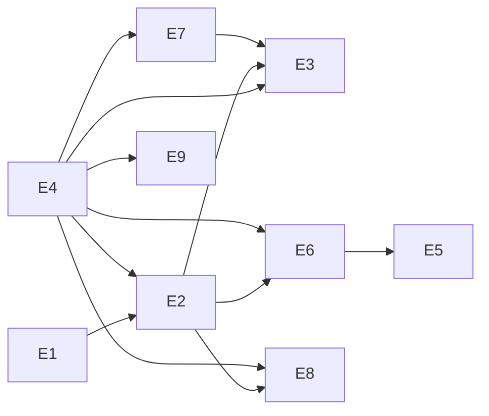

# usebugreport — Epic Breakdown Overview

v1.0 launch epics **E1–E9** cover launch gates **LG-1..LG-11** and FRs **FR-1..FR-15, FR-17..FR-23, FR-26**. Fast-follow epics **E10–E11** cover **FR-16, FR-24, FR-25** (and FF-4 webhook event).

Per-epic story files live alongside this overview. Story IDs: `E{n}-S{m}`.

## Epic Index

| Epic | Title | Gate | Stories | File |
| --- | --- | --- | ---: | --- |
| E1 | Capture SDK | Launch (LG-1) | 5 | [E01-capture-sdk.md](./E01-capture-sdk.md) |
| E2 | Ingest Pipeline & Storage | Launch (LG-1, LG-8, LG-11) | 8 | [E02-ingest-pipeline-storage.md](./E02-ingest-pipeline-storage.md) |
| E3 | Web App Core | Launch (LG-2, LG-3, LG-9) | 10 | [E03-web-app-core.md](./E03-web-app-core.md) |
| E4 | Auth, RBAC & Tier Enforcement | Launch (LG-3, LG-8) | 6 | [E04-auth-rbac.md](./E04-auth-rbac.md) |
| E5 | MCP Server | Launch (LG-5, LG-6) | 3 | [E05-mcp-server.md](./E05-mcp-server.md) |
| E6 | REST API & Parity | Launch (LG-6) | 4 | [E06-rest-api.md](./E06-rest-api.md) |
| E7 | Linear Outbound | Launch (LG-4) | 4 | [E07-linear-outbound.md](./E07-linear-outbound.md) |
| E8 | Outbound Webhooks | Launch (LG-10) | 4 | [E08-webhooks.md](./E08-webhooks.md) |
| E9 | GDPR Cascading Deletion | Launch (LG-7) | 4 | [E09-gdpr-deletion.md](./E09-gdpr-deletion.md) |
| E10 | Agent Write (`create_comment`) | Fast-follow FF-1 | 2 | [E10-agent-write-fast-follow.md](./E10-agent-write-fast-follow.md) |
| E11 | v1.1 Integrations | Fast-follow v1.1 | 3 | [E11-v11-integrations-fast-follow.md](./E11-v11-integrations-fast-follow.md) |

**Launch scope:** 48 stories across E1–E9. **Fast-follow:** 5 stories across E10–E11.

## Launch Gate Coverage

| Launch Gate | Requirement | Epic / Stories |
| --- | --- | --- |
| LG-1 | SDK ingest (replay, console, network, screenshot, metadata) | E1-S2..S5, E2-S2..S4 |
| LG-2 | Replay viewer + report detail + **web comments** | E3-S7, E3-S8 |
| LG-3 | Workspace/Project CRUD + RBAC | E4-S1..S4, E3-S1..S2 |
| LG-4 | Linear outbound push | E7-S1..S4, E3-S6 |
| LG-5 | MCP read suite incl. `search_reports` | E5-S1..S3 |
| LG-6 | REST parity via shared service layer | E6-S1..S4, E5-S3 |
| LG-7 | GDPR cascading deletion | E9-S1..S4 |
| LG-8 | Fair-use rate limits + tier quotas | E2-S6, E4-S6 |
| LG-9 | Superuser triage (list, ⌘K, keyboard, workspace switcher) | E3-S3..S6, E3-S9..S10 |
| LG-10 | Outbound webhooks (`report.created`, `report.updated`) | E8-S1..S4 |
| LG-11 | Tiered R2 retention enforcement | E2-S7 |

## Functional Requirement Coverage

| FR | Summary | Epic / Stories | Scope |
| --- | --- | --- | --- |
| FR-1 | SDK instant replay | E1-S2, E2-S2..S4 | Launch |
| FR-2 | Console/network privacy | E1-S2 | Launch |
| FR-3 | Screenshot + metadata | E1-S3, E2-S4 | Launch |
| FR-4 | Ingest auth + rate limits | E2-S2..S6, E4-S3 | Launch |
| FR-5 | Report metadata + FTS | E2-S5 | Launch |
| FR-6 | Replay viewer | E3-S7 | Launch |
| FR-7 | Tiered blob retention | E2-S7 | Launch |
| FR-8 | Workspace/project CRUD + gate | E4-S1..S3, E3-S1..S2 | Launch |
| FR-9 | Project RBAC | E4-S4 | Launch |
| FR-10 | GDPR cascade | E9-S1..S4 | Launch |
| FR-11 | Dense list + bulk status + bulk Linear | E3-S4..S6 | Launch |
| FR-12 | Command palette ⌘K | E3-S9 | Launch |
| FR-13 | Workspace switcher | E3-S3 | Launch |
| FR-14 | MCP auth + Free read-only | E5-S1, E4-S6 | Launch |
| FR-15 | MCP read tool suite | E5-S2..S3 | Launch |
| FR-16 | Agent `create_comment` | E10-S1..S2 | **Fast-follow FF-1** |
| FR-17 | REST report endpoints | E6-S2..S3 | Launch |
| FR-18 | Shared service layer | E6-S1, E6-S4, E5-S3 | Launch |
| FR-19 | Outbound webhooks | E8-S1..S3 | Launch (FF-4 comment event → E11-S3) |
| FR-20 | Linear OAuth config | E7-S1 | Launch |
| FR-21 | Push report to Linear | E7-S2..S4, E3-S6 | Launch |
| FR-22 | Workspace API keys | E4-S5 | Launch |
| FR-23 | Session + bearer auth | E4-S1 | Launch |
| FR-24 | Linear inbound sync | E11-S1 | **Fast-follow v1.1** |
| FR-25 | GitHub Issues outbound | E11-S2 | **Fast-follow v1.1** |
| FR-26 | Web app report comments | E3-S8 | Launch (LG-2) |

## Architecture Carryover Checklist

| Board mandate | Story |
| --- | --- |
| E3 web comment composer → `POST /api/web/reports/:id/comments` → `CommentService` | E3-S8 |
| E3 bulk status + bulk Linear push (FR-11) | E3-S5, E3-S6 |
| AD-11 tier enforcement at service boundary | E4-S6, E8-S1 |
| FR-26 / LG-2 human web comments v1.0 | E3-S8 |
| Parity tests: real REST HTTP + MCP Streamable HTTP | E6-S4, E5-S3 |
| E2 inline-ingest ack latency measurement | E2-S3 |
| E7 outbox pending/failed conflict branches | E7-S3 |
| E8 SSRF IP-pinning | E8-S3 |
| Retention stale-pending sweep >24h | E2-S7 |
| Worker ops: memory, RSS concurrency, graceful shutdown | E2-S8 |
| GDPR tombstone ordering + idempotent resume | E9-S1..S3 |

## Cross-Epic Dependency Graph (launch)

## Epic List (user value)

### Epic E1: Capture SDK
Integrators embed `@usebugreport/browser` to capture 2-minute Instant Replay, console, network, screenshot, and metadata on explicit submit.
**FRs:** FR-1, FR-2, FR-3 (ingest auth delegated to E2).

### Epic E2: Ingest Pipeline & Storage
Submitted captures durably land in R2 + Postgres with quotas, async finalize, retention authority, and worker reliability.
**FRs:** FR-4, FR-5, FR-7.

### Epic E3: Web App Core
Keyboard-first triage: dense report list, bulk actions, replay viewer, human comments, ⌘K palette, workspace switcher.
**FRs:** FR-6, FR-8 (UI), FR-11, FR-12, FR-13, FR-26.

### Epic E4: Auth, RBAC & Tier Enforcement
GitHub OAuth, mandatory onboarding gate, workspace/project CRUD, project RBAC, API keys, AD-11 tier limits at services.
**FRs:** FR-8, FR-9, FR-22, FR-23.

### Epic E5: MCP Server
Streamable HTTP MCP at `/mcp` exposing read tools with Free-tier read-only enforcement.
**FRs:** FR-14, FR-15.

### Epic E6: REST API & Parity
Versioned REST at `/api/v1` via shared services; surface registry; real HTTP parity contract tests.
**FRs:** FR-17, FR-18.

### Epic E7: Linear Outbound
OAuth connect, outbox-backed push with race-safe dedupe, pending/failed conflict handling.
**FRs:** FR-20, FR-21.

### Epic E8: Outbound Webhooks
Pro+ webhook registration, HMAC delivery, SSRF-safe IP pinning, debug UI.
**FRs:** FR-19.

### Epic E9: GDPR Cascading Deletion
Tombstone-ordered workspace deletion: external cleanup before Postgres purge, idempotent resume.
**FRs:** FR-10.

### Epic E10: Agent Write (Fast-follow FF-1)
`create_comment` via MCP + REST sharing `CommentService` with web comments.
**FRs:** FR-16.

### Epic E11: v1.1 Integrations (Fast-follow)
Linear inbound sync, GitHub Issues outbound, `report.comment.created` webhook.
**FRs:** FR-24, FR-25, FR-19 (comment event).
