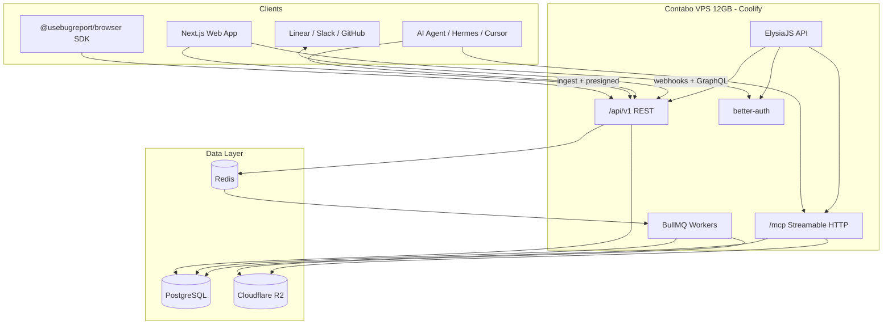

# usebugreport Platform Architecture: Comprehensive Technical Research

**Date:** 2026-07-20  
**Author:** King  
**Research Type:** Technical  
**Project:** usebugreport (Verasic Labs)

---

## Research Overview

This document evaluates how to build a jam.dev / marker.io / betterbugs-class bug-reporting and session-capture platform on the founder's preferred stack. Research covers six pillars: capture technology, AI-agent-native access (MCP + REST), storage and data modeling, multi-tenancy with better-auth, webhooks and integrations, and a consolidated feasibility verdict with v1 architecture.

Key conclusion: **v1 should ship as an embeddable JS SDK (rrweb + console/network plugins) with optional Chrome extension later**, backed by **Postgres metadata + R2 blobs**, **better-auth organizations + API keys**, and a **dual-surface ElysiaJS API** (REST for integrations, Streamable HTTP MCP for agents). The 12 GB VPS is viable for compute and hot metadata; blob retention must be tiered and offloaded to R2 lifecycle rules early.

---

## Table of Contents

1. [Executive Summary](#executive-summary)
2. [Capture Technology](#1-capture-technology)
3. [AI-Agent-Native Access (MCP + REST)](#2-ai-agent-native-access-mcp--rest)
4. [Storage & Data Model Implications](#3-storage--data-model-implications)
5. [Multi-Tenancy with better-auth](#4-multi-tenancy-with-better-auth)
6. [Webhooks & Integration Surface](#5-webhooks--integration-surface)
7. [Risks, Feasibility Verdicts & v1 Architecture](#6-risks-feasibility-verdicts--v1-architecture)
8. [Implementation Roadmap](#7-implementation-roadmap)
9. [Sources & Methodology](#8-sources--methodology)

---

## Executive Summary

### Key Technical Findings

| Area | Verdict | v1 Recommendation |
|------|---------|-------------------|
| Session capture | **Feasible** on stack | rrweb incremental DOM replay + official console/network plugins; circular buffer "instant replay" (2 min) |
| Browser extension | **Feasible but defer** | MV3 service-worker constraints add 4–6 weeks; SDK covers owned apps first |
| MCP for agents | **Feasible, production-ready** | `@modelcontextprotocol/server` v1.x (stable) on Bun; Streamable HTTP at `/mcp` |
| REST + MCP from Elysia | **Feasible** | Shared service layer; community `elysia-mcp` or thin adapter over official SDK |
| Storage (R2 + Postgres) | **Feasible, required pattern** | Postgres for metadata/search; R2 for replay blobs; never store raw events in Postgres |
| 12 GB VPS | **Viable for early SaaS** | Async ingestion via BullMQ + Redis; aggressive retention defaults |
| better-auth multi-tenancy | **Mature enough** | `organization()` plugin + `apiKey()` for agents; custom roles for project/client RBAC |
| Integrations | **Standard patterns** | Outbound webhooks + OAuth app credentials for Linear/GitHub/Jira/Slack; Telegram Bot API |

### Top Strategic Recommendations

1. **Capture v1 = embeddable SDK only** — smallest slice that delivers jam-class value on customer sites you control; extension is phase 2 for "capture anywhere."
2. **Agent-native = first-class MCP tools mirroring Jam** — `get_report`, `get_console_logs`, `get_network_requests`, `get_replay_summary`, `list_reports` with PAT/API-key auth scoped to workspace.
3. **Storage = metadata hot, blobs cold** — gzip/brotli batch compression server-side; R2 lifecycle delete at 30/90 days per plan tier; Redis + BullMQ for ingest pipeline on Bun.

---

## 1. Capture Technology

### 1.1 How jam.dev-Class Tools Capture Bugs

Industry leaders converge on a **layered capture model**:

| Layer | What is captured | Typical mechanism |
|-------|------------------|-------------------|
| Visual | Screenshot, annotation, optional screen video | Canvas capture, `getDisplayMedia`, or DOM replay (no pixels) |
| Session replay | DOM mutations, clicks, scrolls, navigation | rrweb-style incremental snapshots |
| Console | `log/warn/error`, unhandled rejections | MAIN-world monkey-patch or rrweb console plugin |
| Network | fetch/XHR timing, status, headers, bodies | MAIN-world patch, `webRequest` (extension), or rrweb network plugin |
| Environment | URL, viewport, DPR, browser, OS, network speed | `navigator`, `window`, Performance API |
| Custom context | user ID, feature flags, app version | SDK `setMetadata()` / `jam.metadata()` pattern |
| Source maps | Unminified stack traces | CI upload of `.map` files keyed by release/build ID |

**Jam.dev** ([Creating a Jam](https://jam.dev/docs/creating-a-jam), [Instant Replay](https://jam.dev/docs/record-a-jam/instant-replay)) combines:

- **Instant Replay**: up to 2 minutes of **DOM session replay** (not screen video), buffered locally until user clicks Create.
- **Console logs, network requests, user events, device metadata** attached automatically.
- **Chrome extension** for internal QA; **Recording Links** for external reporters without install.
- **SDK custom logs** via `jam.metadata()` for app-specific context.

**Marker.io** ([Features](https://marker.io/features), [@marker.io/browser SDK](https://www.npmjs.com/package/@marker.io/browser)) emphasizes:

- Embeddable **widget snippet** or **Browser SDK** (`loadWidget`, `capture()`, `setReporter`, `setCustomData`).
- Screenshot-first with auto metadata; network logs on widget captures.
- Browser extension for capture on arbitrary sites (no embed required).

### 1.2 rrweb: Core Session Replay Engine

[rrweb](https://rrweb.com/docs/recipes/plugin-api) is the de-facto open-source engine for DOM-based replay:

- **Full snapshot once** + **incremental deltas** (mutations, input, scroll) — scales with *change*, not DOM size ([rrweb blog on AI agents](https://rrweb.com/blog/session-replay-infrastructure-for-ai-agents)).
- Typical **30-minute session: 1–5 MB gzipped** ([BrightCoding deep dive](https://www.blog.brightcoding.dev/2025/09/01/record-and-replay-user-sessions-on-the-web-a-deep-dive-with-rrweb)).
- Official plugins ([plugin API docs](https://rrweb.com/docs/recipes/plugin-api)):
  - `@rrweb/rrweb-plugin-console-record` / `-replay`
  - `@rrweb/rrweb-plugin-network-record` / `-replay` (fetch/XHR patch; merged in 2025–2026)
- Network plugin supports `ignoreRequestFn` to **exclude ingest endpoints** and prevent feedback loops ([PR #1105](https://github.com/rrweb-io/rrweb/pull/1105)).

**PostHog's production architecture** ([Session replay handbook](https://posthog.com/handbook/engineering/session-replay/session-replay-architecture)) validates the pattern usebugreport should follow:

- Batch events → compress (Snappy) → object storage (S3/R2) with byte-range reads.
- ClickHouse/metadata index separate from blob storage.
- 10-second ingest buffering to reduce write ops.

**Amplitude's 2025 delivery optimizations** ([Amplitude blog](https://amplitude.com/blog/session-replay-data-delivery)) show batch-level compression beats per-event compression (22–36% smaller on DOM-heavy sessions) and highlight `sendBeacon` 64 KB limits — use fetch for primary upload, beacon as unload fallback.

### 1.3 Capture Surface Comparison

| Approach | Pros | Cons | Best for |
|----------|------|------|----------|
| **Embeddable JS SDK** | Works on customer staging/prod; no store approval; full control of rrweb config; aligns with API-first pillar | Only captures pages where snippet is installed; cross-origin iframes need extra handling | **v1 primary** — owned apps, client UAT sites |
| **Browser extension (MV3)** | Capture any URL; richer permissions (`webRequest`, tab capture) | MV3 SW dies after ~30s idle; MAIN-world injection required for console/network ([BugMojo MV3 guide](https://www.bugmojo.com/blog/engineering/building-a-bug-capture-extension-on-manifest-v3)); Chrome Web Store review | **Phase 2** — internal QA, "capture anywhere" |
| **Both** | Maximum reach (Jam/Marker.io model) | Two codebases sharing capture core package | **Target architecture by v1.5** |

#### MV3 Extension Architecture (when built)

Per [BugMojo](https://www.bugmojo.com/blog/engineering/building-a-bug-capture-extension-on-manifest-v3) and [Chrome SW lifecycle docs](https://developer.chrome.com/docs/extensions/develop/concepts/service-workers/lifecycle):

```
┌─────────────┐     postMessage      ┌──────────────────┐
│ MAIN world  │ ──────────────────► │ Content script   │
│ interceptor │   console/network   │ (isolated world) │
│ (patch)     │                     │ rrweb buffer     │
└─────────────┘                     └────────┬─────────┘
                                           │ chrome.runtime
                                           ▼
                                  ┌──────────────────┐
                                  │ Service worker   │
                                  │ upload pipeline  │
                                  │ chrome.storage   │
                                  └──────────────────┘
```

- **Never** store capture buffers in SW globals — use `chrome.storage.session` or IndexedDB ([Chrome SW guidance](https://github.com/googlechrome/modern-web-guidance/blob/main/skills/chrome-extensions/references/extensions/service-worker.md)).
- rrweb buffer in content script; upload in SW.

### 1.4 Console, Network, Screenshots, Video, Metadata, Source Maps

| Capability | v1 | Implementation notes |
|------------|-----|----------------------|
| Console logs | ✅ | `@rrweb/rrweb-plugin-console-record` |
| Network (fetch/XHR) | ✅ | `@rrweb/rrweb-plugin-network-record`; redact auth headers by default |
| DOM replay | ✅ | rrweb core; 2-min circular buffer for "instant replay" |
| Screenshot | ✅ | `html2canvas` or rrweb full snapshot render at submit time |
| Annotation | ⚠️ defer | Canvas overlay on screenshot — phase 1.5 |
| Screen video | ❌ defer | Heavy (MB–GB); jam offers it via extension; not needed for v1 differentiation |
| Device/browser metadata | ✅ | Collect at submit: UA, viewport, DPR, URL, timestamp, connection type |
| HAR export | ⚠️ partial | Network plugin JSON is sufficient; full HAR is export format, not capture |
| Source maps | ⚠️ v1.5 | CI upload `.map` files to R2 keyed by `releaseId`; server-side unminify on error stacks using `source-map-js` ([industry pattern](https://docs.datadoghq.com/real_user_monitoring/guide/upload-javascript-source-maps.md)) |

### 1.5 Recommended v1 Capture Approach

**Smallest viable slice:**

```typescript
// Conceptual — NOT production code
useBugReport.init({
  projectKey: 'pk_live_...',
  bufferSeconds: 120,        // instant replay window
  captureConsole: true,
  captureNetwork: true,
  networkBodyMaxBytes: 32_768,
  maskInputs: ['password', 'credit-card'],
  metadata: () => ({ userId, releaseId }),
});
```

**Monorepo package layout:**

```
packages/
  capture-core/     # rrweb record, plugins, buffer, privacy masks
  capture-sdk/      # @usebugreport/browser — embeddable snippet
  capture-extension/  # (empty stub — phase 2)
```

**Evolution path:**

| Phase | Deliverable |
|-------|-------------|
| **v1.0** | SDK: instant replay + console + network + screenshot + metadata |
| **v1.5** | Annotation, source map upload API, recording links (tokenized URL, no install) |
| **v2.0** | Chrome MV3 extension sharing `capture-core` |
| **v2.5** | Optional screen video (extension-only), canvas plugin |

**Confidence:** High — rrweb + plugins are battle-tested (PostHog, Amplitude, OpenReplay ecosystem).

---

## 2. AI-Agent-Native Access (MCP + REST)

### 2.1 Competitive Reference: Jam MCP

Jam ships a **hosted MCP server** at `https://mcp.jam.dev/mcp` ([Jam MCP docs](https://jam.dev/docs/jam-mcp)) with tools:

| Tool | Purpose |
|------|---------|
| `getDetails` | Report snapshot + routing hints |
| `getConsoleLogs` | Filtered logs (`logLevel`, `limit`) |
| `getNetworkRequests` | JSON requests (`statusCode`, `host`, `limit`) |
| `getUserEvents` | Clicks, inputs, navigation as plain language |
| `getScreenshot` | Visual frames |
| `getMetadata` | Custom SDK metadata |
| `listJams`, `createComment`, etc. | Workspace operations |

Auth: **OAuth2** for interactive clients; **Personal Access Tokens** (`jam_pat_...`) with scopes `mcp:read` / `mcp:write` for headless/CI ([PAT docs](https://jam.dev/docs/debug-a-jam/mcp/personal-access-tokens)).

**usebugreport should mirror this tool surface** — it is the proven "agent-friendly" contract.

### 2.2 MCP TypeScript SDK State (July 2026)

| Package | Status | Notes |
|---------|--------|-------|
| `@modelcontextprotocol/server` v2 | **Beta** (2026-07-28 spec RC) | Split packages; Zod v4 / Standard Schema; Bun supported ([TS SDK README](https://github.com/modelcontextprotocol/typescript-sdk)) |
| `@modelcontextprotocol/sdk` v1.x | **Production stable** | Bug fixes + security for ≥6 months post-v2 GA |
| Transports | stdio + **Streamable HTTP** | Remote agents via HTTP; stateless 2026-07-28 revision ([MCP blog](https://blog.modelcontextprotocol.io/posts/sdk-betas-2026-07-28/)) |

**Recommendation:** Ship v1 on **`@modelcontextprotocol/server` v1.x** (or v2 beta only after July 2026 GA if stable). Bun is officially supported.

### 2.3 Agent-Friendly REST API Shape

Agents and integrations share data but differ in ergonomics:

| Concern | REST (integrations) | MCP (agents) |
|---------|---------------------|--------------|
| Discovery | OpenAPI 3.1 at `/openapi.json` | `tools/list`, `resources/list` |
| Auth | `Authorization: Bearer ubr_live_...` (API key) | Same key or OAuth for human-delegated agents |
| Pagination | Cursor-based: `?cursor=&limit=50` | Tool param `limit` + `cursor` |
| Filtering | `?status=open&project=...&since=ISO8601` | Tool params mirroring filters |
| Summaries | `GET /reports/:id/summary` — **token-efficient** markdown/JSON | `get_report_summary` tool |
| Bulk | `GET /reports?fields=id,title,status,createdAt` sparse fieldsets | `list_reports` with `fields` |
| Idempotency | `Idempotency-Key` header on POST | N/A (read-heavy) |

**Summary endpoint design** (critical for LLM token budgets):

```json
{
  "id": "rpt_abc",
  "title": "Checkout button unresponsive",
  "status": "open",
  "reporter": { "email": "qa@client.com" },
  "environment": { "browser": "Chrome 138", "os": "macOS", "url": "..." },
  "errorSummary": "TypeError: Cannot read properties of null (×3)",
  "failedRequests": [{ "method": "POST", "url": "/api/checkout", "status": 500 }],
  "userFlow": ["Navigated to /cart", "Clicked #checkout", "..."],
  "replayAvailable": true,
  "replayDurationMs": 87000
}
```

Inspired by rrweb's shift toward **semantically dense, token-efficient recordings** ([rrweb AI agents blog](https://rrweb.com/blog/session-replay-infrastructure-for-ai-agents)).

### 2.4 API Key Auth with better-auth

better-auth provides dedicated plugins:

- **`apiKey()` plugin** — org-scoped or user-scoped keys, expiration, rate limits, permissions metadata ([API key docs](https://better-auth.com/docs/plugins/api-key))
- **`bearer()` plugin** — session token as Bearer for non-cookie clients ([Bearer docs](https://better-auth.com/docs/plugins/bearer))

**Agent auth model for v1:**

| Key type | Prefix | Scope | Use case |
|----------|--------|-------|----------|
| Workspace API key | `ubr_live_` | Organization + permissions | CI agents, Telegram Hermes, MCP |
| Project ingest key | `ubr_ingest_` | Single project, write-only | SDK snippet (public in browser — restrict to capture endpoints only) |

Ingest keys must be **write-only** and rate-limited; never expose workspace read keys in browser SDK.

### 2.5 Serving REST + MCP from One ElysiaJS Backend

**Recommended architecture:**

```
┌─────────────────────────────────────────────────────────┐
│                    ElysiaJS App                          │
├─────────────────────────────────────────────────────────┤
│  /api/v1/*          REST routes (OpenAPI via @elysiajs/  │
│                     swagger)                             │
│  /mcp               Streamable HTTP MCP (elysia-mcp or   │
│                     createMcpHandler adapter)            │
│  /api/auth/*        better-auth handler                  │
├─────────────────────────────────────────────────────────┤
│              Domain services (shared)                    │
│  ReportService │ CaptureIngestService │ SummaryService   │
├─────────────────────────────────────────────────────────┤
│  Postgres (Drizzle) │ Redis │ R2 (S3 API)               │
└─────────────────────────────────────────────────────────┘
```

**Integration options:**

1. **[elysia-mcp](https://github.com/kerlos/elysia-mcp)** — explicit tool registration in `setupServer`; full control; maps cleanly to Jam-like tools.
2. **[@8monkey/elysia-mcp](https://github.com/8monkey-ai/elysia-mcp)** — auto-expose REST routes as MCP tools; fast bootstrap but coarse for capture-specific tools (prefer explicit for v1).
3. **Official SDK `createMcpHandler`** — mount alongside Elysia via fetch handler or separate port behind reverse proxy.

**Pattern:** MCP tools are **thin wrappers** calling the same `ReportService` methods as REST handlers — zero duplicated business logic.

```typescript
// Conceptual
server.registerTool('get_console_logs', { reportId, limit, logLevel }, async (args) =>
  reportService.getConsoleLogs(args.reportId, args)
);
```

**Confidence:** High for REST; Medium-High for MCP (community Elysia plugins exist; official SDK mature on Bun).

---

## 3. Storage & Data Model Implications

### 3.1 Replay Payload Sizes

| Scenario | Uncompressed | Gzipped (typical) |
|----------|--------------|-------------------|
| 2-min instant replay (active SPA) | 200 KB – 2 MB | 50 – 500 KB |
| 10-min full session | 500 KB – 5 MB | 150 KB – 1.5 MB |
| 30-min session | 2 – 15 MB | 1 – 5 MB |
| + network bodies (capped) | +32–128 KB | +10–40 KB |
| Screenshot (WebP) | 100 – 800 KB | N/A |

**Planning assumption for 12 GB VPS:** compute/memory bound, **not** blob bound — blobs go to R2.

**Rough capacity (single VPS, metadata only in Postgres):**

- Postgres: ~500 MB for 100K report rows (metadata, indexes)
- Redis: 256 MB for queues + hot cache
- Remaining RAM for Elysia + workers + Next.js SSR
- R2: unlimited scale; cost driven by storage GB-months + egress

### 3.2 Postgres vs R2 Split

| Store | Contents |
|-------|----------|
| **PostgreSQL** | organizations, projects, reports (title, status, reporter, env JSON), report_events index (counts, URLs), integration configs, API keys (hashed), webhook subscriptions, audit log |
| **Cloudflare R2** | replay event batches (`.json.gz`), screenshots (`.webp`), optional source maps (`/maps/{releaseId}/`), network body overflow |

**R2 conventions:**

```
{bucket}/
  {orgId}/{projectId}/{reportId}/
    replay/batch-{seq}.json.gz
    screenshot.webp
    meta.json
  maps/{releaseId}/{file}.map
```

**Ingest pipeline:**

1. SDK POSTs batch to `/api/v1/capture/ingest` (presigned URL pattern for large payloads)
2. Elysia validates ingest key → enqueues BullMQ job
3. Worker compresses (if not client-compressed), writes R2 multipart for >5 MB ([R2 multipart docs](https://developers.cloudflare.com/r2/objects/multipart-objects/))
4. Updates Postgres report row with blob pointers + derived metadata (error count, URL list)

### 3.3 Retention on 12 GB VPS + R2

| Tier | Replay retention | Screenshot | Postgres row |
|------|------------------|--------------|--------------|
| Free | 7 days | 7 days | 30 days (summary only after) |
| Pro | 30 days | 90 days | Indefinite metadata |
| Enterprise | 90–365 days | 1 year | Indefinite |

Implement via **R2 lifecycle rules** ([Cloudflare lifecycle docs](https://developers.cloudflare.com/r2/buckets/object-lifecycles/)):

- Prefix `{orgId}/` with `Expiration.Days` per plan (enforced at upload path)
- `AbortIncompleteMultipartUpload` after 1 day (tighten default 7-day)

**Never** retain blobs on VPS disk — local disk only for temp processing.

### 3.4 Redis Usage

| Use | Tool | Notes |
|-----|------|-------|
| Job queues | **BullMQ** | Officially Bun-compatible since CI testing ([BullMQ Bun benchmark](https://bullmq.io/articles/benchmarks/bunjs-vs-nodejs/)); `createBunRedisClient` in v5.77+ ([pluggable clients guide](https://bullmq.io/articles/guides/pluggable-redis-clients/)) |
| Rate limiting | Redis sliding window | API keys, ingest endpoints |
| Session cache | Redis | Optional; better-auth can use DB sessions initially |
| Pub/sub | Redis | Real-time report status in web app (optional v1.5) |

**Alternatives considered:**

| Option | Fit |
|--------|-----|
| `@elysiajs/bullmq` / custom Elysia plugin | Thin wrapper over BullMQ — fine |
| `Bun.redis` raw queues | DIY — not worth it vs BullMQ |
| In-process queues | ❌ loses jobs on restart |

**Confidence:** High — BullMQ + Redis + R2 is industry-standard (PostHog pattern).

### 3.5 Suggested Drizzle Schema (Core Entities)

```
organizations ─┬─ projects ─┬─ reports ─┬─ report_blobs (r2_key, type, size, seq)
               │            │           └─ report_summary (derived, JSONB)
               ├─ members (role)
               └─ api_keys (hash, scopes, org_id)

integrations (type, oauth_tokens_encrypted, config JSONB)
webhook_endpoints (url, secret, events[])
webhook_deliveries (status, payload, attempts)
```

Row-level isolation: every query filters by `organization_id` from session/API key context.

---

## 4. Multi-Tenancy with better-auth

### 4.1 Organization Plugin State (2026)

better-auth's **`organization()` plugin** is production-ready ([organization docs](https://www.better-auth.com/docs/plugins/organization)):

- CRUD for organizations, members, invitations
- **Active organization** on session (`setActive`) — critical for query scoping
- Default roles: `owner`, `admin`, `member`
- Optional **teams** sub-grouping
- **Dynamic access control** for runtime custom roles (use for project-level permissions)
- Hooks at invitation/create/update lifecycle

Configuration example (conceptual):

```typescript
organization({
  allowUserToCreateOrganization: true,
  organizationLimit: 10,
  membershipLimit: 500,
  creatorRole: 'owner',
  invitationExpiresIn: 60 * 60 * 24 * 7,
  sendInvitationEmail: async (data) => { /* Resend */ },
})
```

### 4.2 Mapping Product Model → Auth Model

| Product concept | Auth entity | Notes |
|-----------------|-------------|-------|
| Workspace | `organization` | Top-level tenant boundary |
| Client (agency model) | `organization` metadata or `team` | Optional `teams` for client sub-groups |
| Project | App table `projects.organization_id` | Ingest keys scoped to project |
| Report | App table `reports.project_id` | All blobs namespaced by org/project |

### 4.3 RBAC Design

**Layer 1 — Organization roles (better-auth built-in):**

| Role | Capabilities |
|------|--------------|
| owner | Billing, delete org, all projects |
| admin | Manage members, all projects, integrations |
| member | Create/view reports on assigned projects |

**Layer 2 — Project ACL (app-level, v1):**

```
project_members (project_id, user_id, role: viewer | reporter | developer | admin)
```

| Project role | View reports | Capture | Manage integrations | Delete |
|--------------|-------------|---------|---------------------|--------|
| viewer | ✅ | ❌ | ❌ | ❌ |
| reporter | ✅ | ✅ | ❌ | ❌ |
| developer | ✅ | ✅ | ✅ | ❌ |
| admin | ✅ | ✅ | ✅ | ✅ |

Enforce in Elysia middleware: resolve `session` or `apiKey` → `organizationId` → check project membership.

**Layer 3 — API key permissions (agents):**

```json
{ "scopes": ["reports:read", "reports:write", "mcp:tools"] }
```

### 4.4 GitHub OAuth

Stack default: **better-auth GitHub OAuth** for human login; org invitation flow for teammates. Service accounts use API keys only (no OAuth).

**Confidence:** High — better-auth organization + apiKey plugins cover the model; project ACL is straightforward app logic.

---

## 5. Webhooks & Integration Surface

### 5.1 Outbound Webhooks (usebugreport → customer systems)

**Events to emit:**

| Event | Payload highlights |
|-------|-------------------|
| `report.created` | id, title, url, project, reporter, env summary |
| `report.updated` | status change, assignee |
| `report.comment.created` | thread for Slack/Linear sync |

**Delivery guarantees:**

- HMAC-SHA256 signature header (`X-UseBugReport-Signature`)
- Exponential backoff (1m, 5m, 30m, 2h, 24h); max 5 attempts
- Store deliveries in `webhook_deliveries` for debug UI
- Respond to customer endpoint expectation: **200 within 5s** (async processing on their side)

### 5.2 Inbound Integrations (push reports outward)

| Integration | Direction | Mechanism |
|-------------|-----------|-----------|
| **Linear** | Outbound create + inbound status sync | GraphQL `issueCreate` mutation; webhooks with `Linear-Signature` HMAC ([Linear webhooks](https://linear.app/developers/webhooks)); `@linear/sdk` webhook client |
| **GitHub** | Outbound | REST `POST /repos/{owner}/{repo}/issues`; GitHub App for multi-tenant OAuth |
| **Jira** | Outbound | REST issue create via OAuth 2.0 (3LO); webhook for status |
| **Slack** | Outbound notify | Incoming webhook URL or `chat.postMessage` via Bot token; slash command `/bug` → your API ([pattern reference](https://clepti.com/product/bug-report-automation-workflow-slack-linear/)) |
| **Telegram** | Agent + notify | Bot API for Hermes agent alerts; deep link to report; agent uses MCP/API with PAT |

### 5.3 Linear Integration Detail (v1 priority)

**Create issue from report:**

```graphql
mutation {
  issueCreate(input: {
    teamId: "..."
    title: "[UBR] Checkout failure"
    description: "## Report\nhttps://app.usebugreport.com/r/abc\n\n## Console\n```\nTypeError...\n```"
  }) { issue { id url } }
}
```

**Sync status back:** Register Linear webhook → on `Issue` update → map Linear state → report status.

Use **`LinearWebhookClient`** from `@linear/sdk/webhooks` ([SDK webhooks](https://linear.app/developers/sdk-webhooks)) — verify raw body before JSON parse.

### 5.4 Integration Architecture

```
Report created
     │
     ▼
IntegrationService.dispatch('report.created')
     │
     ├──► Webhook fan-out (customer URLs)
     ├──► Linear (if configured)
     ├──► GitHub Issues
     ├──► Slack notification
     └──► Telegram (optional)
```

All outbound via **BullMQ jobs** — never block ingest path.

**Confidence:** High — standard OAuth + webhook patterns; no exotic dependencies.

---

## 6. Risks, Feasibility Verdicts & v1 Architecture

### 6.1 Feasibility by Product Pillar

| Pillar | Feasible? | Risk level | Notes |
|--------|-----------|------------|-------|
| (1) Superuser web app | ✅ Yes | Low | Next.js + Mantine + TanStack Query — standard |
| (2) API-first integrations | ✅ Yes | Low | Elysia + OpenAPI + webhooks |
| (3) AI-agent-native MCP | ✅ Yes | Medium | MCP SDK evolving (v2 beta); pin v1.x; mirror Jam tools |
| (4) Human web app | ✅ Yes | Low | Replay viewer = rrweb-player + Mantine layout |
| (5) Multi-tenant workspaces | ✅ Yes | Medium | Project ACL is custom; org plugin handles 80% |

### 6.2 Top Risks

| # | Risk | Impact | Mitigation |
|---|------|--------|------------|
| **1** | **Privacy / PII in replays** (passwords, health data) | Legal + trust | Input masking, network header redaction, blocklist selectors, consent banner config, R2 encryption at rest |
| **2** | **Ingest payload blow-up** on heavy SPAs | VPS/R2 cost, slow uploads | Client-side batch gzip; body size caps; sampling; checkout every N ms |
| **3** | **MV3 extension complexity** if pulled into v1 | Schedule slip | Defer extension; SDK-first |

**Secondary risks:**

- Source map URL mismatch (common pain — [OpenReplay issue #3409](https://github.com/openreplay/openreplay/issues/3409)) → strict releaseId discipline
- MCP spec churn (v2 beta) → pin versions, abstract transport
- Single VPS SPOF → acceptable for v1; Coolify health checks + R2/Postgres backups

### 6.3 v1 Architecture Diagram



### 6.4 v1 Scope Boundary (Explicit Non-Goals)

- ❌ Chrome extension
- ❌ Screen video recording
- ❌ Mobile native capture
- ❌ Self-serve SSO/SCIM
- ❌ Real-time collaborative replay viewing
- ❌ Full HAR export UI

---

## 7. Implementation Roadmap

| Sprint | Focus | Exit criteria |
|--------|-------|---------------|
| S1 | Capture SDK + ingest API | 2-min replay uploads to R2; report row in Postgres |
| S2 | Web app viewer + org auth | GitHub login, create org/project, view replay |
| S3 | MCP + API keys | Agent can `get_console_logs` + `get_report_summary` with PAT |
| S4 | Webhooks + Linear | Report → Linear issue; status webhook back |
| S5 | Polish + retention | R2 lifecycle, rate limits, privacy masks |

---

## 8. Sources & Methodology

### Primary Sources

| Topic | Source |
|-------|--------|
| rrweb architecture | https://rrweb.com/docs/recipes/plugin-api |
| rrweb payload sizes | https://www.blog.brightcoding.dev/2025/09/01/record-and-replay-user-sessions-on-the-web-a-deep-dive-with-rrweb |
| PostHog replay storage | https://posthog.com/handbook/engineering/session-replay/session-replay-architecture |
| Jam capture model | https://jam.dev/docs/record-a-jam/instant-replay |
| Jam MCP tools | https://jam.dev/docs/jam-mcp |
| Marker.io SDK | https://www.npmjs.com/package/@marker.io/browser |
| MV3 extension patterns | https://www.bugmojo.com/blog/engineering/building-a-bug-capture-extension-on-manifest-v3 |
| MCP TypeScript SDK | https://github.com/modelcontextprotocol/typescript-sdk |
| MCP 2026-07 spec beta | https://blog.modelcontextprotocol.io/posts/sdk-betas-2026-07-28/ |
| Elysia MCP plugin | https://github.com/kerlos/elysia-mcp |
| better-auth organization | https://www.better-auth.com/docs/plugins/organization |
| better-auth API keys | https://better-auth.com/docs/plugins/api-key |
| BullMQ on Bun | https://bullmq.io/articles/benchmarks/bunjs-vs-nodejs/ |
| R2 lifecycle | https://developers.cloudflare.com/r2/buckets/object-lifecycles/ |
| Linear webhooks | https://linear.app/developers/webhooks |

### Methodology

- Web search verification for all 2025–2026 claims (MCP v2 beta, BullMQ Bun adapter, rrweb network plugin GA)
- Cross-reference competitor docs (Jam, Marker.io) for feature parity baseline
- Stack constraint: recommend founder defaults unless genuinely unfit (no Radix; Mantine/base-ui only)

### Confidence Levels

| Section | Confidence |
|---------|------------|
| Capture (SDK + rrweb) | **High** |
| Storage split | **High** |
| MCP/API design | **High** (Medium on Elysia plugin maturity) |
| Multi-tenancy | **High** |
| Integrations | **High** |
| 12 GB VPS viability | **Medium-High** (depends on traffic; R2 offloads blobs) |

---

## Technical Research Conclusion

usebugreport is **technically feasible entirely within the founder's stack**. The highest-leverage v1 bet is an **embeddable rrweb-based SDK** with Jam-parity MCP tools and a **Postgres + R2 + BullMQ** backend on Elysia/Bun. Defer the Chrome extension and video capture to reduce scope while preserving a clear evolution path to full jam.dev-class parity.

**Next steps:** PRD → architecture doc → `capture-core` package spike (record 2-min buffer, upload to R2 presigned URL, replay in rrweb-player).

---

**Technical Research Completion Date:** 2026-07-20  
**Document Status:** Complete  
**Source Verification:** All critical claims cited with public URLs
